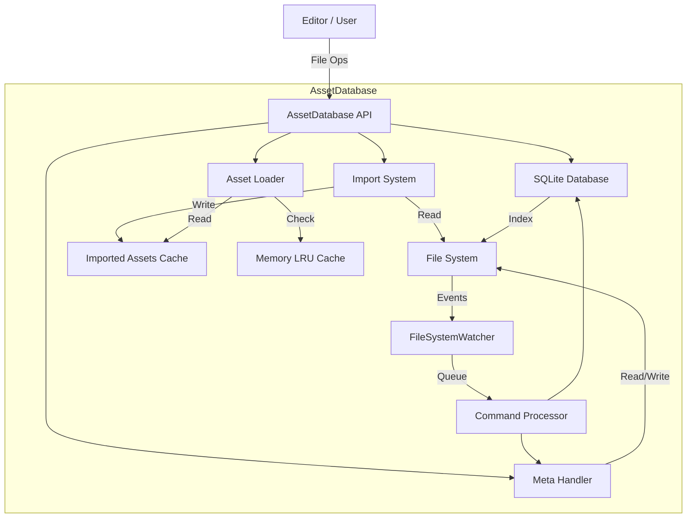

# Asset Database Architecture

This document details the architectural design and data flow of the `AssetHandle` module in Ghost Editor.

## System Overview

The Asset Database acts as the bridge between the raw file system (Source Assets) and the runtime engine (Imported Assets). It maintains a consistent state using a dual-storage approach:
1.  **File System**: The source of truth. Contains source files (e.g., `.png`, `.fbx`) and metadata files (`.gmeta`).
2.  **SQLite Database**: An acceleration layer (cache) for fast lookups, dependency tracking, and searching.

## Data Flow

### 1. Asset Discovery & Registration
When the editor starts or a file changes:
1.  **FileSystemWatcher** detects the change (Create/Delete/Modify/Rename).
2.  **Event Handler** queues an `AssetCommand` (debounce mechanism prevents event storms).
3.  **Command Processor** executes the command:
    *   **New File**: Generates a `.gmeta` file with a new GUID and default settings. Adds to SQLite.
    *   **Modified File**: Checks hash. If changed, marks asset as "Dirty" and updates SQLite.
    *   **Deleted File**: Removes from SQLite and marks dependents as "Dirty".

### 2. Import Pipeline
The import process converts source formats into engine-ready data.

**Flow:**
1.  `AssetDatabase.ImportDirtyAssetsAsync()` or direct `ImportAssetAsync` is called.
2.  System looks up the registered `AssetImporter` for the file extension.
3.  `AssetImporter.ImportAsync` is invoked with the source path and metadata.
4.  Importer reads source file and settings from metadata.
5.  Importer processes data (e.g., compiles shaders, compresses textures).
6.  Importer calls `AssetDatabase.SaveImportedAsset(guid, data)`.
7.  Data is serialized to JSON (or binary) in the `Cache/ImportedAssets` directory as `{GUID}.asset`.

### 3. Loading Pipeline
When the engine requests an asset:

**Flow:**
1.  `AssetDatabase.LoadAsset<T>(guid)` is called.
2.  **Memory Cache Check**:
    *   Checks `s_assetCache` (ConcurrentDictionary).
    *   If found: Updates LRU timestamp and returns object.
    *   If not found: Proceeds to disk load.
3.  **Disk Load**:
    *   Locates `{GUID}.asset` in `Cache/ImportedAssets`.
    *   Deserializes the data into the target runtime type (e.g., `TextureAsset`).
4.  **Cache Update**:
    *   Adds new object to `s_assetCache`.
    *   If cache size > `MAX_CACHED_ASSETS` (1000), evicts oldest 20% based on access time.

## Key Components Diagram

## Database Schema (SQLite)

The `AssetDatabase.db` contains a single `Assets` table:

| Column | Type | Description |
|--------|------|-------------|
| **Guid** | TEXT (PK) | The unique identifier of the asset. |
| **Path** | TEXT | Relative path from `Assets/` folder. Indexed for fast lookup. |
| **Version** | INTEGER | Importer version for migration support. |
| **Tags** | TEXT | JSON array of string tags. |
| **FileHash** | TEXT | SHA256 hash of the source file content. |
| **DependencyGuids** | TEXT | JSON array of GUIDs this asset depends on. |
| **LastModified** | INTEGER | Unix timestamp of last modification. |

## Detailed Subsystems

### Metadata System (`.gmeta`)
*   **Format**: JSON.
*   **Content**: GUID, Version, Tags, ImporterSettings (per importer type).
*   **Strategy**: The `.gmeta` file is the *only* place the persistent GUID lives. If the database is corrupted, it can be rebuilt entirely by scanning the file system and reading `.gmeta` files.

### Threading & Safety
*   **Locks**:
    *   `s_dbLock`: Protects in-memory dictionaries (`s_assetPathLookup`) and dirty tracking.
    *   `s_commandLock`: Protects the command queue for file events.
*   **Async**: Heavy I/O operations (DB access, File I/O) are async.
*   **Channels**: Uses `System.Threading.Channels` to decouple high-frequency file system events from database processing.

### Importer Registry
*   Uses `TypeCache` and reflection to find classes with `[AssetImporter]`.
*   Mappings are stored in `s_importerTypeLookup` (Extension -> Type).
*   Importers are stateless (instantiated on demand or cached as singletons depending on implementation, currently cached in `s_importerInstances`).

## Future Improvements / Known Limitations

1.  **Binary Formats**: Currently, imported assets are stored as JSON. For large assets (textures, models), a binary format is required for performance.
2.  **Dependency Graph**: While dependencies are stored, a full graph traversal for complex invalidation (e.g., if A changes, re-import B which depends on A) is partial.
3.  **Cross-Process Locking**: SQLite is file-based; concurrent access from multiple editor instances needs careful file locking mode configuration.
