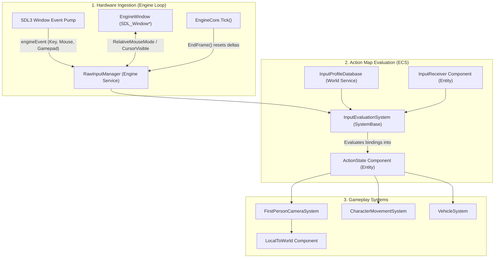

# GhostEngine Input System — Developer Guide

This document provides a comprehensive guide to GhostEngine's **Data-Oriented Input System** for developers and AI agents. It covers architecture, core components, how to author action maps, and how to consume input in ECS systems.

---

## 1. Design Philosophy

Traditional game engines often rely on object-oriented event callbacks:
```csharp
// ❌ Anti-pattern in ECS
binding.OnKeyPressed("Jump") += OnPlayerJump;
```

In GhostEngine's ECS runtime (`Ghost.Entities`), this pattern is avoided for critical architectural reasons:
1. **Unmanaged Memory**: Components implement `IComponentData` and must be `unmanaged` value types living in contiguous native memory chunks. They cannot store managed delegates or object references.
2. **Deterministic System Ordering**: OS events occur asynchronously during window event polling. Triggering gameplay callbacks mid-poll breaks system execution order, multithreading, and job safety.
3. **Intent Decoupling**: Separating *input state* from *gameplay response* allows the exact same gameplay systems (e.g., character movement, vehicle physics) to be driven by a human player, a network replay, or an AI agent simply by writing to the same component.

GhostEngine uses a **3-tier data-driven pipeline**:
$$\text{Raw Hardware Events (SDL3)} \longrightarrow \text{Action Map Evaluation} \longrightarrow \text{ActionState Components} \longrightarrow \text{Gameplay Systems}$$

---

## 2. Architecture & Data Flow



---

## 3. Core Types and Data Structures

### A. Unified Control Identifier: `InputControl`
Located in `Ghost.Engine.Input.InputControl`.

A 4-byte explicit-layout struct that represents **any physical input across any device** (similar to Unreal's `FKey`):
- `DeviceType Device`: `Keyboard`, `Mouse`, or `Gamepad`.
- `byte DeviceIndex`: Player index (0..3 for multiple gamepads).
- `ushort ControlId`: Raw keycode, mouse control ID, or gamepad button/axis.

**Factory Helpers:**
```csharp
InputControl.Key(SDL_Keycode.SDLK_SPACE)
InputControl.Mouse(MouseControl.LeftButton)
InputControl.GamepadBtn(SDL_GamepadButton.SDL_GAMEPAD_BUTTON_SOUTH)
InputControl.GamepadAxis(SDL_GamepadAxis.SDL_GAMEPAD_AXIS_LEFTX)
```

### B. Hardware Service: `RawInputManager`
Located in `Ghost.Engine.Input.RawInputManager`.

Owned by `EngineCore` and auto-registered as a service to all active `World` instances on `Start()`.
- **Physical Hot-plugging**: Listens to `SDL_EVENT_GAMEPAD_ADDED` and `SDL_EVENT_GAMEPAD_REMOVED`, mapping controllers to player indices (0..3). Automatically closes handles and clears state on disconnect.
- **Active Device Detection**: Tracks `ActiveDevice` (`Keyboard`, `Mouse`, `Gamepad`) to enable dynamic UI prompt switching (e.g. swapping `[E]` for `(A)`).
- **Mouse Capture & Lock APIs**: Encapsulates window mouse control without leaking `EngineWindow` into ECS:
  - `RelativeMouseMode`: Locks the mouse into the window, hides the cursor, and produces unbounded `MouseDelta` (`xrel`, `yrel`).
  - `CursorVisible`: Toggles system cursor visibility.
- **Frame Lifecycle**: Automatically cleared at the end of each frame via `InputManager.EndFrame()` in `EngineCore.Tick()`.

### C. Universal Action Component: `ActionState`
Located in `Ghost.Engine.Components.ActionState`.

An `unmanaged` struct (`IComponentData`) that stores all evaluated inputs for an entity in **44 bytes** (fits within a single 64-byte CPU cache line):
- Up to 32 digital buttons tracked via bitmasks (`_buttonsDown`, `_buttonsPressed`, `_buttonsReleased`).
- Up to 8 analog axes tracked via an inline fixed buffer (`fixed float _axes[8]`).

**Read APIs (All marked `readonly` to avoid defensive copying):**
```csharp
bool isDown = actionState.IsDown(ActionButton.Sprint);
bool wasPressed = actionState.WasPressed(ActionButton.Jump);
bool wasReleased = actionState.WasReleased(ActionButton.Primary);
float elevation = actionState.GetAxis(ActionAxis.Elevation);
float2 move = actionState.GetVector2(ActionAxis.MoveX, ActionAxis.MoveY);
```

### D. Entity Link: `InputReceiver`
Located in `Ghost.Engine.Components.InputReceiver`.

An `unmanaged` struct (`IComponentData`) that links an entity to an input profile:
```csharp
public struct InputReceiver : IComponentData
{
    public int ProfileId; // Target InputMap profile ID
    public bool Enabled;   // Allows disabling control without removing components
}
```

---

## 4. How-To Guides

### How to Create an Action Map Profile

Action maps are declared as pure data without writing new systems:

```csharp
using Ghost.Engine.Input;
using SDL;

public static class MyGameProfiles
{
    public const int PLAYER_PROFILE_ID = 10;

    public static InputMap CreatePlayerMap()
    {
        var map = new InputMap();

        // 1. Digital Button with Primary (Keyboard) and Secondary (Gamepad) bindings
        map.Buttons.Add(new ButtonBinding
        {
            Action = ActionButton.Jump,
            Primary = InputControl.Key(SDL_Keycode.SDLK_SPACE),
            Secondary = InputControl.GamepadBtn(SDL_GamepadButton.SDL_GAMEPAD_BUTTON_SOUTH)
        });

        // 2. 2D Movement Composite (WASD)
        map.Composites2D.Add(new Composite2DBinding
        {
            AxisX = ActionAxis.MoveX,
            AxisY = ActionAxis.MoveY,
            Up = InputControl.Key(SDL_Keycode.SDLK_W),
            Down = InputControl.Key(SDL_Keycode.SDLK_S),
            Left = InputControl.Key(SDL_Keycode.SDLK_A),
            Right = InputControl.Key(SDL_Keycode.SDLK_D)
        });

        // 3. Analog Gamepad Left Stick (combines/overrides WASD when pushed)
        map.Sticks2D.Add(new Axis2DStickBinding
        {
            AxisX = ActionAxis.MoveX,
            AxisY = ActionAxis.MoveY,
            StickX = InputControl.GamepadAxis(SDL_GamepadAxis.SDL_GAMEPAD_AXIS_LEFTX),
            StickY = InputControl.GamepadAxis(SDL_GamepadAxis.SDL_GAMEPAD_AXIS_LEFTY),
            InvertY = true, // Up is negative in SDL
            Deadzone = 0.15f
        });

        // 4. Mouse Look
        map.MouseLook = new MouseDeltaBinding
        {
            AxisX = ActionAxis.LookX,
            AxisY = ActionAxis.LookY,
            Sensitivity = 1.0f
        };

        return map;
    }
}
```

Register the profile with the world's `InputProfileDatabase`:
```csharp
var profileDb = world.GetService<InputProfileDatabase>();
profileDb.RegisterProfile(MyGameProfiles.PLAYER_PROFILE_ID, MyGameProfiles.CreatePlayerMap());
```

---

### How to Add Input to an Entity

To make any entity controllable, attach `InputReceiver` and `ActionState` to its archetype:

```csharp
using var archetype = new ComponentSet(scope.AllocationHandle,
    ComponentTypeID<LocalToWorld>.Value,
    ComponentTypeID<MyCharacterComponent>.Value,
    ComponentTypeID<InputReceiver>.Value,
    ComponentTypeID<ActionState>.Value
);

var player = world.EntityManager.CreateEntity(archetype);

// Assign the profile ID and default action state
world.EntityManager.SetComponent(player, new InputReceiver(MyGameProfiles.PLAYER_PROFILE_ID, enabled: true));
world.EntityManager.SetComponent(player, default(ActionState));
```

---

### How to Consume Input in a System

Gameplay systems never check keys or hardware. They simply query `ActionState`:

```csharp
using Ghost.Core;
using Ghost.Engine.Components;
using Ghost.Engine.Input;
using Ghost.Entities;
using Misaki.HighPerformance.Mathematics;

namespace MyGame.Systems;

[UpdateAfter<InputEvaluationSystem>]
public class PlayerMovementSystem : SystemBase
{
    private Identifier<EntityQuery> _queryID;

    protected override void OnInitialize(scoped in SystemAPI systemAPI)
    {
        _queryID = QueryBuilder.New()
            .WithAll<ActionState, LocalToWorld>()
            .Build(systemAPI.World, true);

        RequireQueryForUpdate(_queryID);
    }

    protected override void OnUpdate(scoped in SystemAPI systemAPI)
    {
        var dt = systemAPI.Time.DeltaTime;
        ref var query = ref systemAPI.World.ComponentManager.GetEntityQueryReference(_queryID);

        foreach (var chunk in query.GetChunkIterator())
        {
            var actionStates = chunk.GetComponentData<ActionState>();
            var transforms = chunk.GetComponentDataRW<LocalToWorld>();

            for (var i = 0; i < chunk.EntityCount; i++)
            {
                ref readonly var input = ref actionStates[i];
                ref var transform = ref transforms[i];

                var move = input.GetVector2(ActionAxis.MoveX, ActionAxis.MoveY);
                if (input.WasPressed(ActionButton.Jump))
                {
                    // Trigger jump logic...
                }

                // Apply frame-rate independent movement...
            }
        }
    }
}
```

---

### How to Drive an Entity with AI (Intent Swapping)

Because gameplay systems consume `ActionState` rather than hardware, driving an entity with AI is trivial:
1. Omit or disable `InputReceiver` so `InputEvaluationSystem` does not overwrite it:
   ```csharp
   world.EntityManager.SetComponent(aiEntity, new InputReceiver(0, enabled: false));
   ```
2. Write an `AISystem` that writes directly into `ActionState`:
   ```csharp
   [UpdateBefore<PlayerMovementSystem>]
   public class AISystem : SystemBase
   {
       protected override void OnUpdate(scoped in SystemAPI systemAPI)
       {
           // Calculate AI pathfinding...
           ref var actionState = ref aiActionStates[i];
           actionState.SetAxis(ActionAxis.MoveX, desiredDir.x);
           actionState.SetAxis(ActionAxis.MoveY, desiredDir.y);
           actionState.SetButton(ActionButton.Primary, shouldShoot);
       }
   }
   ```
The downstream `PlayerMovementSystem` or `CombatSystem` executes identically without knowing the source is an AI agent.

---

## 5. First-Person Camera Controller

GhostEngine includes a complete first-person camera controller:
- **Component**: [`FirstPersonCamera`](file:///f:/csharp/GhostEngine/src/Runtime/Ghost.Engine/Components/FirstPersonCamera.cs)
  - `Yaw`: Horizontal view angle in radians.
  - `Pitch`: Vertical view angle in radians (clamped to $[-89^\circ, +89^\circ]$ to prevent gimbal lock).
  - `MoveSpeed`: Base speed (units/sec).
  - `SprintMultiplier`: Multiplier when sprint is held.
  - `MouseSensitivity` (default `0.0008f` rad/pixel) & `GamepadSensitivity` (default `2.0f` rad/s).
  - `InvertY`: If true, inverts the vertical look axis (flight simulator style). Default is `false` (standard FPS look).
  - `RequireRightClickToLook`: Toggle for editor flycam mode vs locked FPS mode.
- **System**: [`FirstPersonCameraSystem`](file:///f:/csharp/GhostEngine/src/Runtime/Ghost.Engine/Systems/FirstPersonCameraSystem.cs)
  - Updates rotation using `rotY * rotX`.
  - Displaces position along view forward, right, and world up directions.
  - Toggles mouse lock when `ActionButton.ToggleMouseLock` (`Escape`) is pressed.

---

## 6. Best Practices & Pitfalls

| Guideline | Explanation |
| :--- | :--- |
| **Use `GetComponentDataRW<T>()` for writing** | When writing to components in a chunk (such as `ActionState` or `LocalToWorld`), use `chunk.GetComponentDataRW<T>()` to bump component versioning. For read-only access, use `chunk.GetComponentData<T>()`. |
| **Mark `ActionState` getters `readonly`** | Calling non-readonly methods on a `ref readonly` struct causes the Roslyn compiler / `Misaki.HighPerformance.Analyzer` to issue warning `MHP002` due to defensive memory copying. |
| **Never query `SDL_Keycode` in gameplay systems** | Hardcoding key checks couples systems to hardware and breaks rebinding, gamepad support, and AI control. Query `ActionState` exclusively. |
| **Scale displacement by `Time.DeltaTime`** | Always multiply speeds and gamepad analog deltas by `systemAPI.Time.DeltaTime` to guarantee frame-rate independence. |
