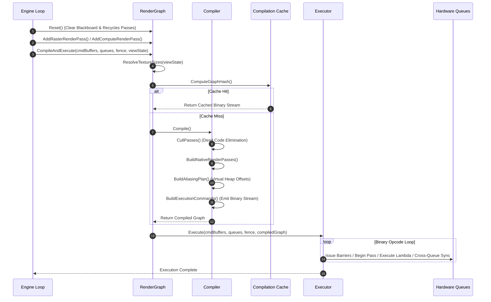

# Render Graph Architecture & Developer Guide

**Module**: `Ghost.Graphics.RenderGraphModule`  
**Target Platform**: .NET 10 / Windows (DirectX 12 / Vulkan RHI)  
**Location**: `src/Runtime/Ghost.Graphics/RenderGraphModule`

---

## 1. Overview & Design Goals

The **GhostEngine Render Graph** is a high-performance, stateless-compiled, data-driven frame graph execution pipeline inspired by Frostbite FrameGraph and Unreal Engine Render Dependency Graph (RDG). It manages GPU resource creation, transient memory aliasing, cross-queue synchronization (Async Compute), native render pass merging, and pass lifecycle execution.

### Key Architectural Pillars
- **Zero GC Allocation per Frame**: Execution, compilation cache hits, and pass recording run with **0 B GC allocations** during normal gameplay frames.
- **Stateless Compilation**: `_passes` (`List<RenderGraphPass>`) in `RenderGraph` acts as the single source of truth. All compiled passes, native passes, and binary opcodes reference passes via integer indices (`int passIndex`).
- **Transient Memory Aliasing (Heap Tier 2)**: Reuses physical VRAM offsets for non-overlapping resource lifetimes, reducing VRAM usage by over 50% (e.g., compressing a 443 MB 4K AAA pipeline down to 205.9 MB).
- **Multi-Queue Async Compute**: Automatic detection of cross-queue dependencies, inserting `SignalFence`, `SubmitQueue`, and `GPUWait` binary opcodes between Graphics and Compute queues.
- **Native Render Pass Merging**: Merges consecutive raster passes with matching attachments into native render passes to minimize load/store operations on TBDR and desktop GPUs.
- **Binary Opcode Execution**: Compiles the graph into a contiguous byte stream (`ReadOnlyView<byte>`) executed by an inline interpreter (`RenderGraphExecutor`).

---

## 2. Core Components & Class Diagram

```
                             ┌───────────────────────────┐
                             │        RenderGraph        │
                             └─────────────┬─────────────┘
                                           │
         ┌─────────────────────────────────┼─────────────────────────────────┐
         │                                 │                                 │
┌────────┴────────┐               ┌────────┴────────┐               ┌────────┴────────┐
│  ResourcePool   │               │     Compiler    │               │     Executor    │
│    & Registry   │               └────────┬────────┘               └────────┬────────┘
└─────────────────┘                        │                                 │
                                  ┌────────┴────────┐               ┌────────┴────────┐
                                  │NativePassBuilder│               │  Binary Opcode  │
                                  └─────────────────┘               │   Stream Reader │
                                                                    └─────────────────┘
```

### 2.1 `RenderGraph` (`RenderGraph.cs`)
The primary developer-facing facade. Handles:
- **Pass Creation**: `AddRasterRenderPass<T>()`, `AddComputeRenderPass<T>()`, `AddUnsafeRenderPass<T>()`.
- **Resource Import/Export**: `ImportTexture()`, `ImportBuffer()`, `ExtractTexture()`, `ExtractBuffer()`.
- **Execution Entry Point**: `CompileAndExecute(...)`.
- **Object Recycling**: `Reset()` recycles passes and clear registries for the next frame.

### 2.2 `RenderGraphResourceRegistry` & `ResourcePool` (`RenderGraphResourcePool.cs`)
Manages logical resources (`RGTexture`, `RGBuffer`) and backing GPU resource handles (`Handle<GPUTexture>`, `Handle<GPUBuffer>`).
- Tracks **producer passes** (`producerPasses`: `UnsafeList<int>`) and **consumer passes** (`consumerPasses`: `UnsafeList<int>`) for every resource.
- Resolves relative texture dimensions (`RGTextureSizeMode.Relative`, `RelativeDepth`) against the current `ViewState` viewport size.

### 2.3 `RenderGraphPass` & Builders (`RenderGraphPass.cs`, `RenderGraphBuilder.cs`)
- **`RenderGraphPass`**: Base class representing a pass node in the graph. Generic pooled subclasses (`RasterRenderGraphPass<T>`, `ComputeRenderGraphPass<T>`, `UnsafeRenderGraphPass<T>`) hold strongly-typed pass data `T`.
- **`RenderGraphBuilder`**: Fluent builder providing methods like `UseTexture()`, `UseBuffer()`, `SetColorAttachment()`, `SetDepthAttachment()`, `EnableAsyncCompute()`, and `SetRenderFunc()`.

### 2.4 `RenderGraphCompiler` (`RenderGraphCompiler.cs`, `RenderGraphCompiler.Barrier.cs`)
Transforms recorded passes into an optimized, execution-ready binary opcode stream.
- **Pass Culling (Dead Code Elimination)**: Traverses backward from imported/extracted resources and passes with `hasSideEffects`. Un-culls all producer passes recursively using `producerPasses`.
- **DAG Building & Reordering**: Builds a Directed Acyclic Graph based on RAW, WAR, and WAW dependencies.
- **Memory Aliasing Planner**: Calculates transient memory lifetimes (`firstUsePass`, `lastUsePass`) and builds an `AliasingPlan` using a first-fit heap allocator.
- **Native Render Pass Merger**: Merges consecutive raster passes with matching color and depth attachments.
- **Binary Command Emission**: Serializes execution steps into a flat byte stream using `BufferWriter`.

### 2.5 `RenderGraphCompilationCache` (`RenderGraphCompilationCache.cs`, `RenderGraphHasher.cs`)
Caches compilation artifacts based on a 64-bit hash of pass inputs and resource topologies (`RenderGraphHasher.ComputeGraphHash`).
- **Cache Hit Performance**: When pass topologies match, compilation completes in **~4–5 $\mu$s with 0 B GC allocations**.

### 2.6 `RenderGraphExecutor` (`RenderGraphExecutor.cs`)
A lightweight, zero-allocation binary opcode interpreter. Reads commands from `BufferReader` and executes:
- `IssueBarriers`: Emits resource layout transitions and memory aliasing barriers to `ICommandBuffer`.
- `BeginNativePass` / `EndNativePass`: Begins/ends native hardware render passes on `ICommandBuffer`.
- `ExecutePass`: Invokes user-defined pass lambda functions `pass.Execute(context)`.
- `SignalFence` / `SubmitQueue` / `GPUWait`: Manages cross-queue GPU sync between Graphics and Compute command queues.

---

## 3. The Binary Execution Opcode Stream

When compiled, the graph produces a contiguous byte array (`ReadOnlyView<byte>`) containing opcode instructions (`RGExecutionOpType`):

| Opcode | Payload Data | Meaning |
|---|---|---|
| `IssueBarriers` | `int count`, `CompiledBarrier[]` | Evaluates and issues GPU resource state transitions and aliasing barriers. |
| `BeginNativePass` | `int nativePassIndex` | Begins a native D3D12/Vulkan render pass with color/depth attachments. |
| `ExecutePass` | `int rawPassIndex` | Executes `_passes[rawPassIndex].Execute(context)`. |
| `EndNativePass` | None | Ends current native render pass. |
| `SignalFence` | `CommandQueueType queue`, `ulong value` | Enqueues a GPU fence signal on the specified queue (`queue.Signal(fence, value)`). |
| `SubmitQueue` | `CommandQueueType queue` | Submits recorded commands on the specified queue (`queue.Submit(cmdBuffer)`). |
| `GPUWait` | `CommandQueueType queue`, `ulong value` | Enqueues a GPU fence wait on the specified queue (`queue.Wait(fence, value)`). |

---

## 4. Execution Lifecycle of a Frame



---

## 5. Transient Memory Aliasing Architecture

### Heap Tier 2 Memory Recycling
Instead of allocating dedicated GPU memory for every render target, the Render Graph calculates the exact active range (`[firstUsePass, lastUsePass]`) of each resource.

1. **Lifetime Calculation**:
   - `firstUsePass`: The earliest pass index that writes or creates the resource.
   - `lastUsePass`: The latest pass index that reads or writes the resource.
2. **First-Fit Heap Allocation**:
   - `RenderGraphAliasingBuilder` places non-overlapping resources into shared physical VRAM offsets on a single `ID3D12Heap`.
3. **Aliasing Barriers**:
   - When Resource B reuses the memory offset previously occupied by Resource A, the compiler automatically inserts an `AliasingBarrier(ResourceA -> ResourceB)` before Resource B is accessed.

### Real-World Savings Example
In a 35-pass 4K AAA render pipeline (3840 x 2160 resolution):
- **Naive Non-Aliased Memory**: ~443 MB
- **Render Graph Aliased Heap Size**: **205.9 MB** (53.5% memory reduction, matching the exact peak concurrency during GBuffer pass).

---

## 6. Pass Culling (Dead Code Elimination)

Pass culling eliminates passes whose outputs are never consumed by any visible screen pass or extracted resource.

1. **Side-Effect Identification**:
   - Passes writing to `isImported` (e.g. BackBuffer) or `isExtracted` resources are marked with `hasSideEffects = true`.
   - Passes with `allowCulling = false` are marked un-culled.
2. **Backward Multi-Producer Traversal**:
   - Starting from un-culled passes, the compiler reads `pass.resourceReads` and un-culls all producer passes registered in `resource.producerPasses`.
   - Passes that write to resources with no active consumers remain `culled = true` and are omitted from the binary opcode stream.

---

## 7. Diagnostics & Debugging (`RenderGraphDump`)

When passing `RGExecutionFlags.GenerateDump` into `CompileAndExecute(...)`, the Render Graph builds a detailed `RenderGraphDump` object containing:
- **`TotalHeapSize`**: Total VRAM footprint in bytes.
- **`MemoryBlocks`**: Heap aliasing layout and offset maps.
- **`Passes`**: List of all recorded passes and culling status.
- **`CommandStream`**: Human-readable disassembly of the binary opcode stream.

### Disassembled Command Stream Example
```text
[0000] SignalFence -> Queue: Graphics, FenceValue: 1
[0001] SubmitQueue -> Queue: Graphics
[0002] GPUWait -> Queue: Compute, FenceValue: 1
[0003] IssueBarriers (1 barriers)
       ├─ Transition: SceneBuffer -> Layout: Undefined, Access: ShaderRead, Sync: Compute
[0004] ExecutePass #0 'AsyncComputeCulling' [Compute]
[0005] SignalFence -> Queue: Compute, FenceValue: 2
[0006] SubmitQueue -> Queue: Compute
[0007] GPUWait -> Queue: Graphics, FenceValue: 2
[0008] BeginNativePass #0 (ColorCount: 1, HasDepth: False)
[0009] ExecutePass #1 'RasterPass' [Raster]
[0010] EndNativePass
```

---

## 8. Best Practices for Engine Developers

1. **Pooled Pass Data**: Always use value types (`struct`) for pass data `TPassData`. Pass objects are recycled via `RenderGraphObjectPool`.
2. **Declare Resource Access Explicitly**: Call `builder.UseTexture()` / `builder.UseBuffer()` for all read/write accesses to ensure correct DAG dependency generation and pass culling.
3. **Avoid Manual Heap Allocations in Pass Lambdas**: Keep render lambdas static (`static (ref readonly data, ctx) => { ... }`) to prevent closure delegate allocations.
4. **Use Async Compute Wisely**: Tag compute passes with `builder.EnableAsyncCompute(true)` only when they can run concurrently alongside independent raster passes (e.g. GPU Culling, Light Binning, Volumetric Fog).
