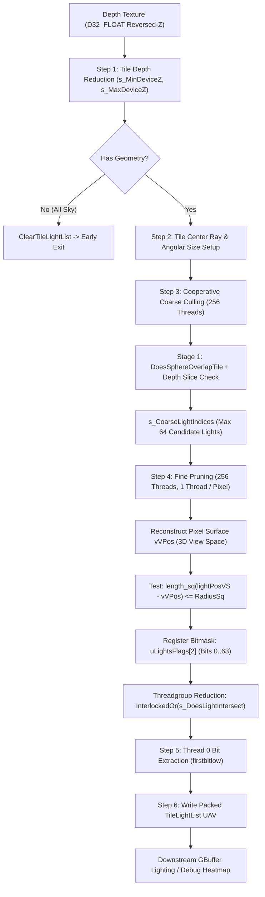

# Fine-Pruned Tiled Light Culling (FPTL) & Spherical Ray-Cone Intersection

This document details the architectural design, mathematical foundations, data layouts, and critical debugging lessons learned during the development of GhostEngine's **Fine-Pruned Tiled Light Culling (FPTL)** pipeline.

---

# Architectural Overview & Motivation

## The Forward+ / Tiled Deferred Problem
In modern high-performance rendering engines, evaluating all lights for every pixel in a naive $O(\text{Pixels} \times \text{Lights})$ loop is prohibitively expensive. Tiled Deferred Shading divides the screen into regular screen-space tiles (typically $16 \times 16$ pixels) and executes a compute shader to build a compact list of lights affecting each tile.

However, naive tile frustum culling suffers from two critical flaws:
1. **Rectilinear Bounding Box Artifacts**: Testing 4 lateral planes ($x \ge x_0 z, x \le x_1 z, y \ge y_0 z, y \le y_1 z$) in clip space clips lights using independent 1D thresholds, producing an axis-aligned rectangular footprint on planar surfaces rather than a smooth spherical footprint.
2. **Depth Discontinuity / Light Leakage**: When a tile contains a foreground object at $Z = 2\,\text{m}$ and a background wall at $Z = 50\,\text{m}$, the tile depth bounds are $[2, 50]$. A light hovering at $Z = 20\,\text{m}$ in empty air overlaps the tile depth range and gets assigned to the tile, wasting shading cycles. Furthermore, a surface outside the light's 3D radius still receives the light if it falls within the tile's screen frustum.

## The Unity HDRP / DICE Two-Stage Solution
GhostEngine implements a state-of-the-art two-stage light culling pipeline inspired by Unity HDRP (`lightlistbuild.compute` / `LightingConvexHullUtils.hlsl`) and DICE FPTL:



---

# Root Cause Analysis: The 2D Frustum Plane Flaw

During initial development, light culling produced severe visual artifacts:
1. **Image 5 Case**: A single punctual light shone on a flat surface produced a razor-sharp axis-aligned **rectangle** across tiles instead of a circle.
2. **Images 1 & 2 Case**: Viewing a Stanford Bunny from the bottom showed illuminated ears; rotating the camera to the side caused the ears to abruptly turn solid black (`count = 0`), even though 3D light-to-surface interaction is strictly view-independent.

## Why 4 Frustum Planes Form Rectangles
The naive frustum culling approach constructed four side planes passing through the view-space origin $(0, 0, 0)$:
```hlsl
s_FrustumPlanes[0] = float4(normalize(float3(1.0f,  0.0f, -x0)), 0.0f); // Left
s_FrustumPlanes[1] = float4(normalize(float3(-1.0f, 0.0f,  x1)), 0.0f); // Right
s_FrustumPlanes[2] = float4(normalize(float3(0.0f,  1.0f, -y0)), 0.0f); // Bottom
s_FrustumPlanes[3] = float4(normalize(float3(0.0f, -1.0f,  y1)), 0.0f); // Top
```
For a sphere with center $\mathbf{C} = (C_x, C_y, C_z)$ and radius $R$, the left plane test is:
$$\frac{C_x - x_0 C_z}{\sqrt{1 + x_0^2}} \ge -R \implies \frac{C_x + R \sqrt{1 + x_0^2}}{C_z} \ge x_0$$

Notice that each plane is an independent 1D threshold in screen space $(x/z, y/z)$. The intersection of four independent half-planes $\{x \ge x_{\min}, x \le x_{\max}, y \ge y_{\min}, y \le y_{\max}\}$ forms an **axis-aligned 2D bounding box (rectangle)** in screen space.

On a planar surface where every pixel has approximately the same depth $Z_{\text{wall}}$, every tile inside this 2D bounding box passes the coarse test. Because depth bounds alone $[Z_{\text{wall}}, Z_{\text{wall}}]$ cannot prune based on lateral radius on the surface, the tile assignment forms a literal rectangle on the wall.

## Why Screen-Space Culling Breaks View Independence
When rotating or panning the camera, the light's center in view space changes. If culling is evaluated against screen columns, rotating the camera causes the light's screen bounding column $[X_{\min}, X_{\max}]$ to shift across the screen. 

If geometry (e.g. bunny ears) is at screen coordinate $X > X_{\max}$, it gets zero lights. But when looking from another angle, the ears fall within the screen bounding columns of that same light. Because 3D Euclidean distance between a surface and a light is an invariant:
$$\|\mathbf{P}_{\text{world}} - \mathbf{C}_{\text{world}}\| = \|\mathbf{P}_{\text{view}} - \mathbf{C}_{\text{view}}\|$$
any culling algorithm that relies purely on screen-space columns violates view invariance.

---

# Coarse Spherical Ray-Cone Culling

To eliminate rectangular tile boundaries and false positives at tile corners, GhostEngine adopts the analytical ray-cone vs sphere intersection method from Unity HDRP (`LightingConvexHullUtils.hlsl`).

## Mathematical Derivation
Instead of testing 4 separate plane half-spaces, we test whether a single ray $\mathbf{V}$ passing through the **center** of the tile intersects the light's bounding sphere, expanded by the diagonal radius of the tile at that depth.

```
                    Tile Center Ray V
  Camera Origin ─────────────────────────>
       (0,0,0)         \     Enlarged Sphere (Radius + s * halfTileSize)
                        \   ┌───────────────┐
                         \  │   Light (C)   │
                          \ │       ●       │
                           \└───────────────┘
```

1. **Tile Center Ray**:
   At $Z = 1$, the tile center in Normalized Device Coordinates (NDC) $[-1, 1]$ is:
   $$\text{ndc}_x = \left((groupID.x \times 16 + 8) \times \frac{1}{\text{Width}}\right) \times 2 - 1$$
   $$\text{ndc}_y = 1 - \left((groupID.y \times 16 + 8) \times \frac{1}{\text{Height}}\right) \times 2$$
   In view space at $Z = 1$:
   $$\mathbf{V} = \left(\frac{\text{ndc}_x}{m_{00}},\, \frac{\text{ndc}_y}{m_{11}},\, 1.0\right)$$

2. **Tile Half-Size at $Z = 1$**:
   A single pixel in view space at $Z = 1$ has dimensions:
   $$dx = \frac{2}{m_{00} \cdot \text{Width}}, \quad dy = \frac{2}{m_{11} \cdot \text{Height}}$$
   For a $16 \times 16$ tile, half the tile is 8 pixels. The diagonal distance from the center to any corner is:
   $$\text{halfTileSizeAtZDistOne} = 8 \times \sqrt{dx^2 + dy^2}$$

3. **Sphere Expansion Along Ray**:
   To ensure conservative coverage even when the sphere is off-axis, we calculate the scalar projection of the sphere center onto the $Z$-axis and expand the sphere radius:
   $$\mathbf{maxZdir} = (-C_z C_x,\, -C_z C_y,\, C_x^2 + C_y^2)$$
   $$\text{offs} = \frac{\mathbf{maxZdir}_z}{\|\mathbf{maxZdir}\|} \times R$$
   $$s = \max(C_z + \text{offs}, 0.0)$$
   $$R_{\text{expanded}} = R + s \times \text{halfTileSizeAtZDistOne}$$

4. **Ray-Sphere Intersection**:
   Solving $\|\mathbf{V} t - \mathbf{C}\|^2 = R_{\text{expanded}}^2$ leads to the quadratic equation:
   $$a = \mathbf{V} \cdot \mathbf{V}, \quad b = \mathbf{C} \cdot \mathbf{V}, \quad c = \mathbf{C} \cdot \mathbf{C} - R_{\text{expanded}}^2$$
   $$\frac{\Delta}{4} = b^2 - a \cdot c$$
   The tile overlaps the sphere if the camera is inside ($c < 0$) or if the forward ray intersects the sphere ($\Delta > 0$ and $b > 0$):
   $$\text{Overlap} \iff (c < 0) \lor (\Delta > 0 \land b > 0)$$

Because this evaluates Euclidean distance to a central ray, the set of rays satisfying this test forms an **elliptical/circular cone** across screen tiles, eliminating rectilinear box boundaries.

## Depth Slice Overlap
In addition to the ray-cone test, the light's view-space $Z$ interval $[C_z - R, C_z + R]$ is tested against the tile's linear view-space depth range $[\text{minViewZ}, \text{maxViewZ}]$:
$$\text{centerVS.z} + R \ge \text{minViewZ} \quad \land \quad \text{centerVS.z} - R \le \text{maxViewZ}$$
If either test fails, the light is rejected immediately. Surviving lights are stored in `s_CoarseLightIndices`.

---

# Fine Pruning (`FinePruneLights`)

While coarse spherical ray-cone culling prunes lights outside the tile frustum, it still cannot solve the problem of surfaces inside the frustum that are physically out of range of the light in 3D world space (e.g., flat floor tiles 20 meters away from a small 5-meter radius light).

**Fine Pruning** solves this by testing the light's 3D sphere directly against the actual reconstructed 3D surface geometry inside the tile.

## Surface Position Reconstruction
Each thread $t \in [0, 255]$ in the compute threadgroup corresponds to exactly one pixel in the $16 \times 16$ tile. If `deviceDepth > 0.0f` (indicating valid geometry in Reversed-Z):
```hlsl
float zView = (n * f) / ((f - n) * deviceDepth + n);
float2 ndc = float2(
    ((float(pixelCoord.x) + 0.5f) * g_ViewData.screenSize.z) * 2.0f - 1.0f,
    1.0f - ((float(pixelCoord.y) + 0.5f) * g_ViewData.screenSize.w) * 2.0f
);
float3 pixelPosVS = float3((ndc.x / m00) * zView, (ndc.y / m11) * zView, zView);
```

## Per-Pixel 3D Distance Test & Bitmask Accumulation
For each coarse light $l \in [0, \min(s\_CoarseLightCount, 64))$:
1. Each thread evaluates the squared 3D Euclidean distance:
   $$\mathbf{toLight} = \mathbf{C}_{VS} - \mathbf{P}_{VS}$$
   $$\text{hit} = (\text{hasValidDepth} \land \|\mathbf{toLight}\|^2 \le R^2)$$
2. If `hit` is true, the thread sets bit $l$ in its local 64-bit register bitmask (`uint uLightsFlags[2]`):
   ```hlsl
   uLightsFlags[l >> 5u] |= (1u << (l & 31u));
   ```
3. Once all coarse lights are evaluated, each thread atomically ORs its register flags into shared memory:
   ```hlsl
   if (uLightsFlags[0] != 0u) InterlockedOr(s_DoesLightIntersect[0], uLightsFlags[0]);
   if (uLightsFlags[1] != 0u) InterlockedOr(s_DoesLightIntersect[1], uLightsFlags[1]);
   ```
4. Thread 0 extracts the active lights using the hardware-accelerated `firstbitlow` instruction:
   ```hlsl
   if (groupIndex == 0u)
   {
       uint count = 0u;
       for (uint w = 0u; w < 2u; ++w)
       {
           uint mask = s_DoesLightIntersect[w];
           while (mask != 0u && count < maxFinalLights)
           {
               uint bit = firstbitlow(mask);
               mask &= ~(1u << bit);
               s_TileLightIndices[count++] = s_CoarseLightIndices[w * 32u + bit];
           }
       }
       s_TileLightCount = count;
   }
   ```

## Theoretical Guarantees
1. **Circular Surface Footprints**: On a flat plane, the intersection of a 3D sphere with the plane is a circle:
   $$\{\mathbf{P} \in \mathbb{R}^3 : \|\mathbf{P} - \mathbf{C}\| \le R \land \mathbf{n} \cdot \mathbf{P} + d = 0\} \implies \text{Circle}$$
   Fine pruning ensures that only tiles containing surface points within this circle accept the light.
2. **Strict View Invariance**: Because the test evaluates $\|\mathbf{C}_{VS} - \mathbf{P}_{VS}\|^2$, and view space is a rigid-body isometric transform of world space, the distance between any surface vertex and the light is completely invariant to camera orientation, camera position, and field-of-view.
3. **Zero Contention**: The loop executes without internal barriers; threads evaluate lights in registers, followed by a single barrier and efficient bit unpacking.

---

# Tile Light List Buffer Layout

The output `TileLightList` buffer is stored as a raw byte-address buffer (`ByteAddressBuffer` / `RWByteAddressBuffer`) indexed per tile:

$$\text{TileIndex} = \text{tileY} \times \text{TilesX} + \text{tileX}$$
$$\text{TileByteOffset} = \text{TileIndex} \times (\text{DWORDS\_PER\_TILE} \times 4)$$

## HLSL Decoding (`LightGridCommon.hlsl`)
Shaders consuming the tile list unpack lights via inline functions:
```hlsl
template<uint DWORDS>
uint GetTileLightCount(ByteAddressBuffer tileLightList, uint tileIndex)
{
    return tileLightList.Load(tileIndex * (DWORDS * 4u)) & 0xFFFFu;
}

template<uint DWORDS>
uint GetTileLightIndex(ByteAddressBuffer tileLightList, uint tileIndex, uint offset)
{
    if (offset == 0u)
    {
        return tileLightList.Load(tileIndex * (DWORDS * 4u)) >> 16u;
    }
    uint dwordIndex = (offset + 1u) / 2u;
    uint raw = tileLightList.Load(tileIndex * (DWORDS * 4u) + dwordIndex * 4u);
    return ((offset + 1u) & 1u) != 0u ? (raw >> 16u) : (raw & 0xFFFFu);
}
```
