# Shader Pipeline Architecture — Proposed Design

> Presented as a design walkthrough. Take what's useful, ignore what doesn't fit your vision.

---

## 1. System Topology

The first decision: **where does each responsibility live?**

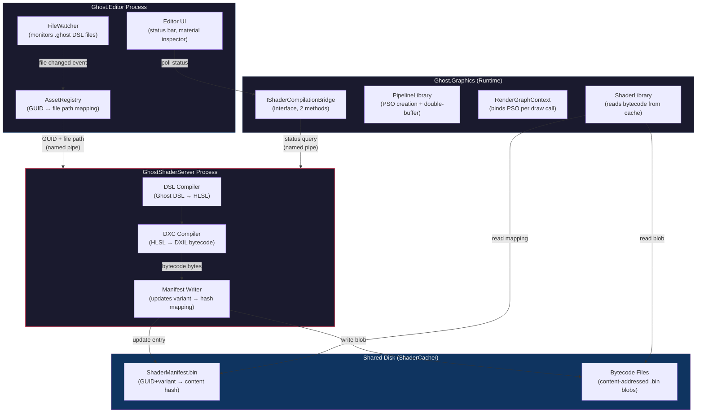

### Why a Separate Process?

| Concern | In-process compiler | Separate process |
|---------|-------------------|------------------|
| DXC crash | Editor dies | Server restarts, editor lives |
| DXC memory leak | Editor bloats over time | Kill & restart server periodically |
| Parallelism | Threads compete with editor UI | Fully independent CPU budget |
| Build pipeline reuse | Need separate build-time path | Same server binary, different mode |
| Complexity | Lower (one process) | Higher (IPC needed) |

> [!TIP]
> If the separate process feels like overkill for your current stage, **start with in-process behind the `IShaderCompilationBridge` interface**, then swap the implementation to out-of-process later. The interface is the same either way.

---

## 2. Data Model — The Manifest

This is the most important data structure in the entire system. It decouples **identity** from **content**.

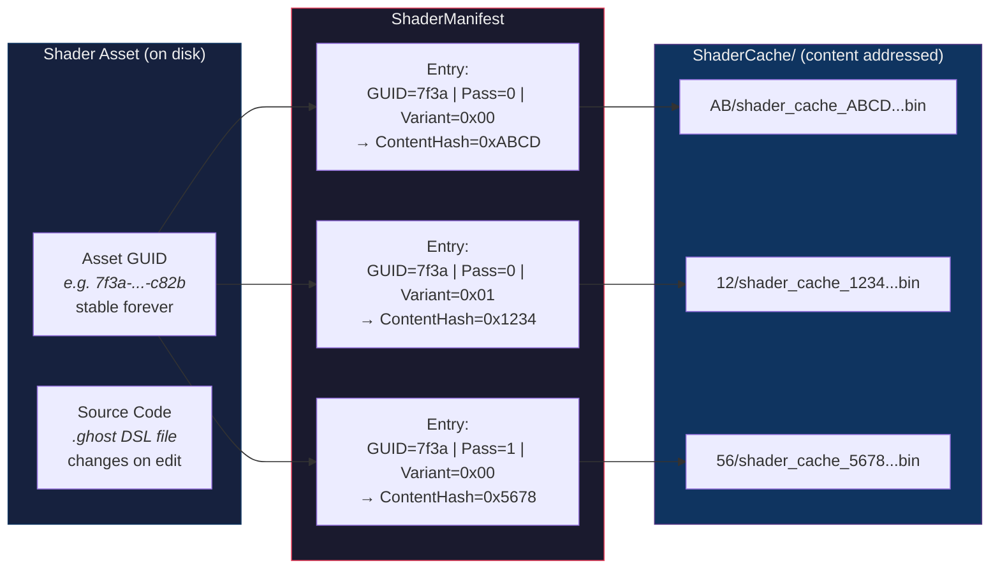

### Manifest Entry Structure

```
ManifestKey = Hash(AssetGUID + PassIndex + VariantKeywordMask)
ManifestValue = ContentHash (= Hash of compiled bytecode)
```

- **ManifestKey** is *structurally* derived — same shader, same pass, same keywords = same key, regardless of source changes.
- **ContentHash** is *content-derived* — changes every time the source code changes.
- When source changes: the ManifestKey stays the same, but the ContentHash it points to gets updated.

> [!IMPORTANT]
> The `Shader` struct in runtime only needs to know the **AssetGUID**. It never stores or cares about content hashes. The `ShaderLibrary` uses the manifest to translate `(GUID, Pass, Variant) → ContentHash → File`.

---

## 3. Compilation Flow — What Happens When You Save a Shader

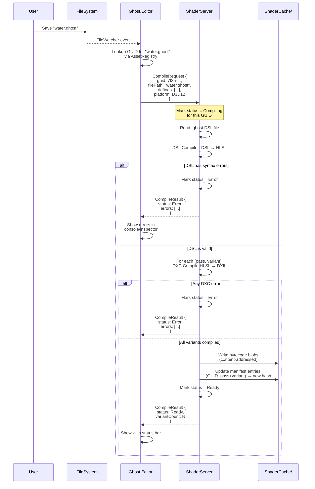

### Key Design Decision: Compile All Variants Upfront?

**No.** Only compile variants that are *currently referenced* by materials in the scene. The editor knows which materials reference which shader (via AssetRegistry), and which keyword combinations those materials use. Ship only what's needed.

For the edit-time hot-reload, you really only need the specific variants the viewport is currently rendering. The full permutation set is a build-time concern.

---

## 4. Runtime PSO Resolution — The Frame-by-Frame Flow

This is where most of the complexity lives. Here's what `SetActiveMaterial` does every frame:

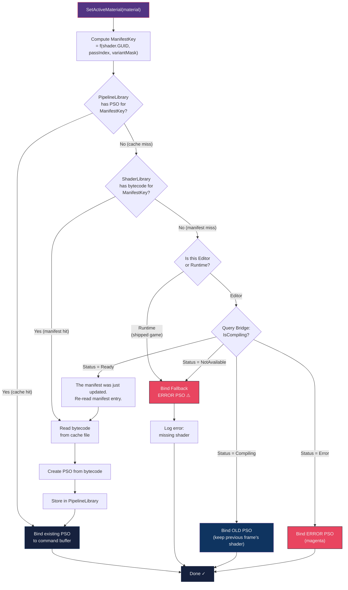

### The "Keep Old PSO" Strategy — How It Works Mechanically

This is the part that makes the UX feel seamless. The trick:

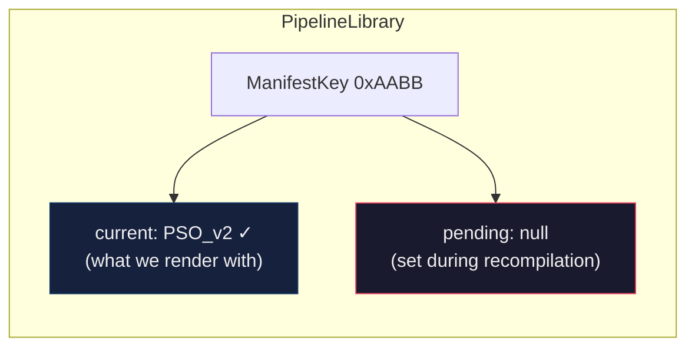

When shader source changes and recompilation starts:

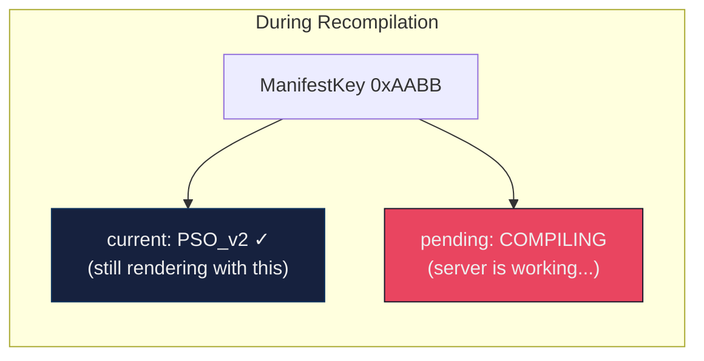

When recompilation finishes successfully:

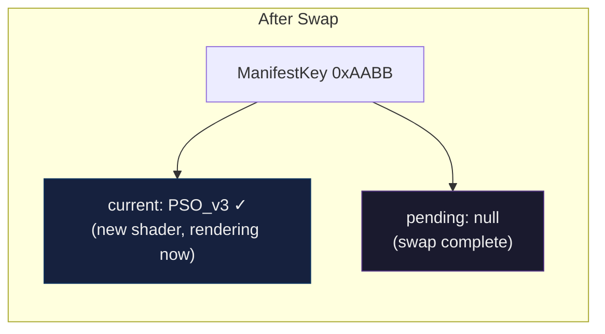

> [!NOTE]
> The old `PSO_v2` is **not immediately destroyed**. It stays alive until the GPU is done with any in-flight frames referencing it (tracked by fence value). This prevents use-after-free on the GPU timeline.

---

## 5. Hot-Reload Sequence — The Complete Picture

Everything combined into one timeline:

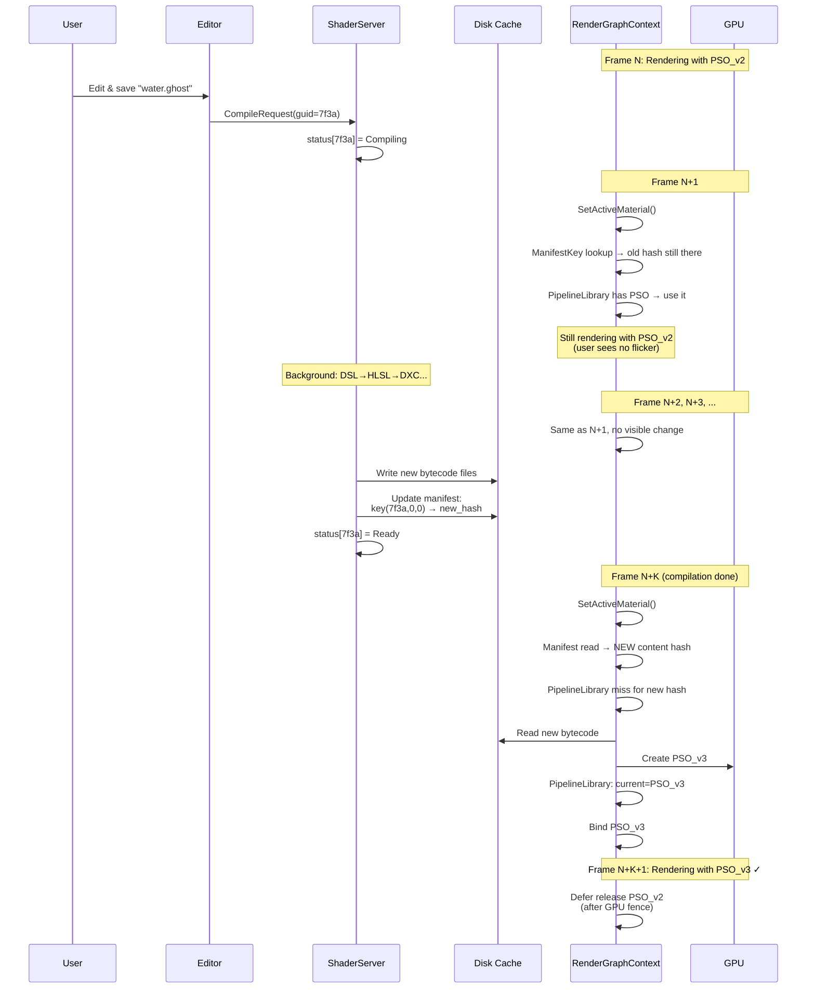

### What the User Sees

| Frame | Viewport | Status Bar |
|-------|----------|------------|
| N | Water renders normally | — |
| N+1 | Water renders normally (old shader) | 🔄 Compiling water.ghost... |
| N+2 | Water renders normally (old shader) | 🔄 Compiling water.ghost... |
| N+K | Water renders with new shader | ✅ water.ghost compiled (2 variants) |

**Zero flicker. Zero blocking. Zero pink frames.**

---

## 6. How the Manifest Key Replaces Your Current Hash Problem

Here's a before/after of your `Shader` struct:

### Current Design (problematic)
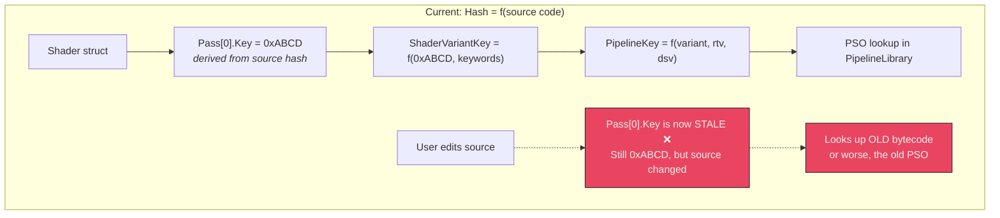

### Proposed Design (stable)
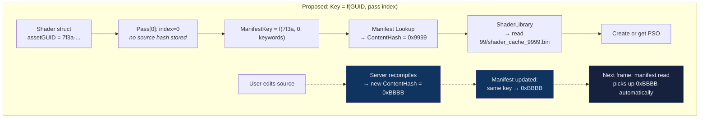

> [!IMPORTANT]
> **The `Shader` struct never changes.** No unload, no recreate, no generation counter bump. The manifest is the *only* mutable state, and it lives on disk, outside the runtime's object graph. The runtime just reads it.

---

## 7. The Two Interfaces That Make This Work

Only two abstractions are needed in `Ghost.Graphics` to support the full pipeline:

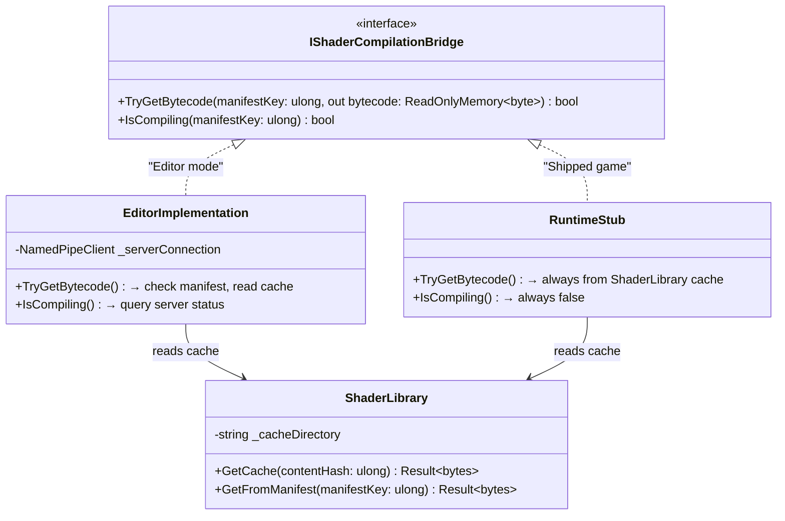

> [!TIP]
> `RenderGraphContext` doesn't talk to the bridge directly. It talks to `ShaderLibrary`, which internally consults the bridge on cache miss. This keeps the rendering code clean — it never sees compilation status. It just gets bytecode or it doesn't.

---

## 8. Build Pipeline — How Shipped Games Work

For completeness, here's how the same architecture handles builds:

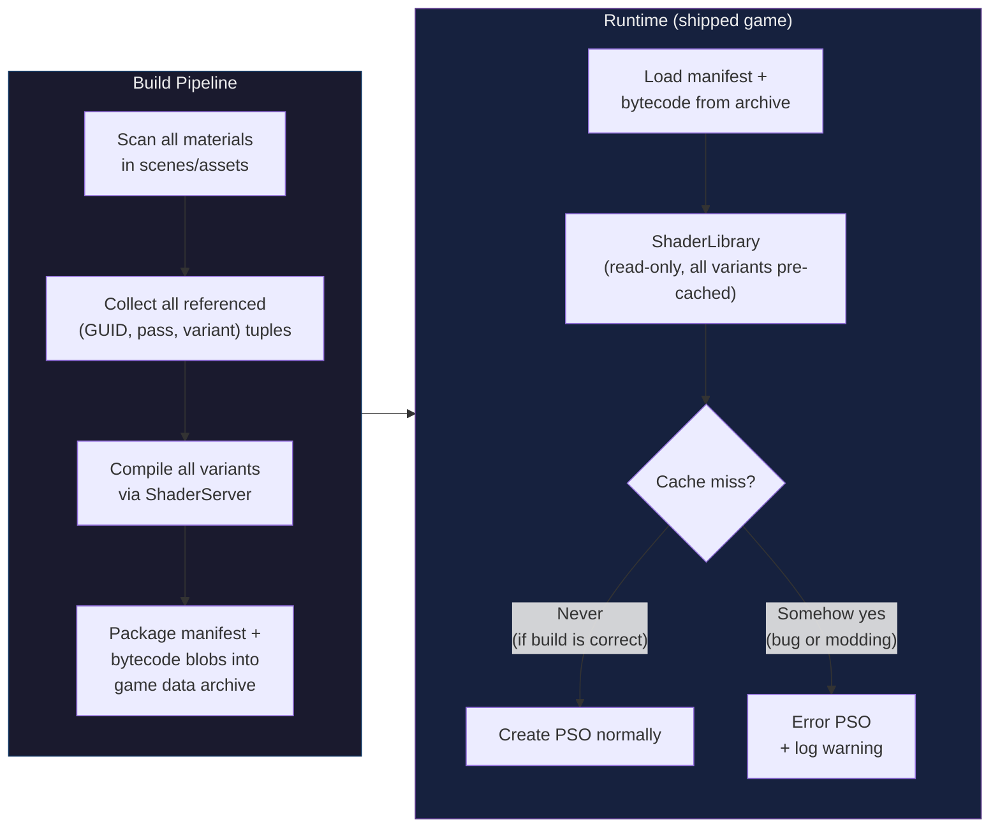

The beauty: **the same `ShaderLibrary` and `PipelineLibrary` code runs in both editor and shipped game**. The only difference is whether `IShaderCompilationBridge` is the editor implementation or the runtime stub.

---

## Summary of Key Design Decisions

| # | Decision | Rationale |
|---|----------|-----------|
| 1 | Stable GUID identity, not content hash | Shader struct never needs recreation on edit |
| 2 | Content-addressed cache | Deduplication, easy invalidation, git-friendly |
| 3 | Manifest as the bridge | Decouples identity from compiled output cleanly |
| 4 | Keep old PSO during recompile | Zero flicker, seamless UX |
| 5 | Separate compiler process | Crash isolation, independent resource budget |
| 6 | Two-method interface in runtime | Minimal coupling, easy to stub for shipped game |
| 7 | Deferred PSO release via fence | Prevents GPU use-after-free |
| 8 | Same code path for editor + shipped | Fewer bugs, one pipeline to maintain |
