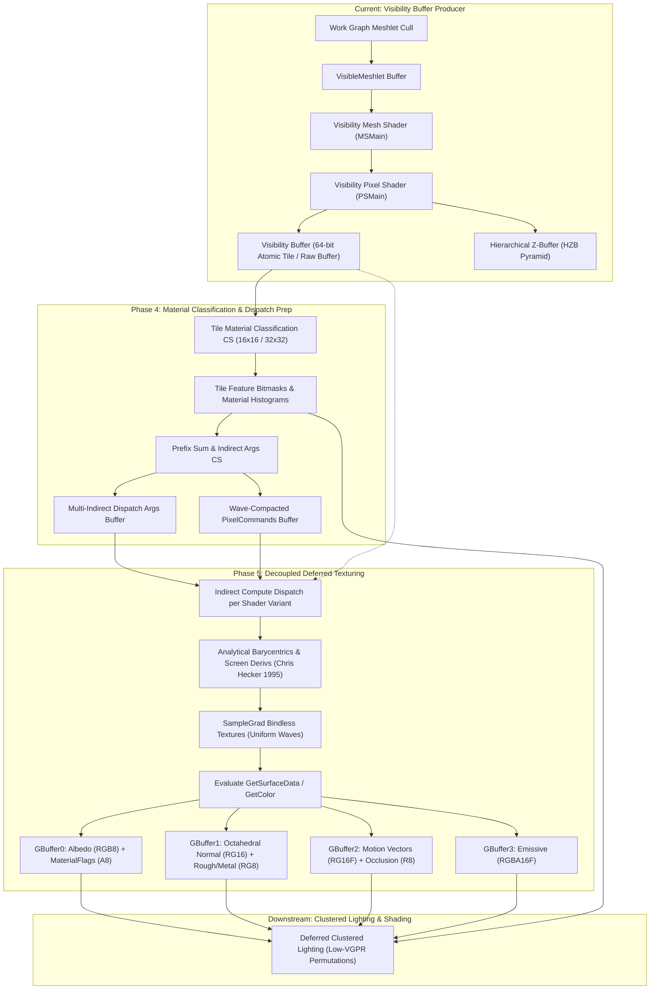
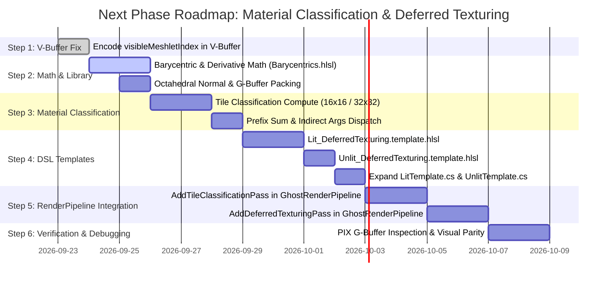

# GhostEngine — Material Classification & Decoupled Deferred Texturing Plan (Phases 4 & 5)

## 1. Executive Summary & Context

With **Phase 2 (Work Graph Meshlet Culling & Two-Pass HZB)** and **Phase 3 (Visibility Buffer Generation)** complete in [`GhostRenderPipeline.cs`](file:///F:/csharp/GhostEngine/src/Runtime/Ghost.Engine/RenderPipeline/GhostRenderPipeline.cs) and [`GhostRenderPipeline.Visibility.cs`](file:///F:/csharp/GhostEngine/src/Runtime/Ghost.Engine/RenderPipeline/GhostRenderPipeline.Visibility.cs), the GPU-driven geometric producer pass is fully functional. The engine rasterizes conservative depth and primitive identifiers with zero CPU draw call overhead.

The immediate next milestone is transitioning to the **geometric consumer passes**:
1. **Phase 4: Material & Feature Tile Classification** (identifying visible material shaders and binning pixel workloads).
2. **Phase 5: Decoupled Deferred Texturing** (evaluating materials in compute without quad over-shading, outputting to a software G-Buffer).
3. **Template Completion** for [`LitTemplate.cs`](file:///F:/csharp/GhostEngine/src/Editor/Ghost.DSL/ShaderCompiler/Templates/LitTemplate.cs) and [`UnlitTemplate.cs`](file:///F:/csharp/GhostEngine/src/Editor/Ghost.DSL/ShaderCompiler/Templates/UnlitTemplate.cs) to compile these compute passes through the DSL compiler.

This architecture directly incorporates the lessons and techniques proven by **id Software in DOOM: The Dark Ages (idTech 8)** (*Dominik Lazarek & Philip Hammer, 2024*), **Horizon Forbidden West** (*James McLaren, GDC 2022*), and **Epic Games Nanite** (*Brian Karis & Graham Wihlidal, SIGGRAPH 2021 / GDC 2024*).



---

## 2. Key Architectural Takeaways from idTech 8 (*DOOM: The Dark Ages*)

Analysis of the idTech 8 presentation reveals critical engineering choices and empirical performance metrics that guide GhostEngine's implementation:

### 2.1 The Quad Dispatch Trap
- **The Experiment**: idTech 8 initially tested the often-cited "Quad Dispatch with Fake Material Depth Buffer" (from Eidos Dawn Engine [Doghramachi17]). For every visible material, a screen quad was drawn testing `Equal` against a depth buffer containing material IDs.
- **The Empirical Result**:
  - Baseline Forward+: **14.30 ms**
  - Quad Dispatch: **14.26 ms** — **Zero performance gain!**
- **Root Cause (Nsight Profiling)**: Material IDs scattered across a screen do not form continuous spatial depth planes. Hardware Hi-Z was completely ineffective; coarse rasterization passed millions of fragments into fine rasterization, choking the GPU front-end and early-Z test stages.
- **GhostEngine Decision**: **Never use Quad-Dispatch for material separation.** Adopt the pure compute dispatch architecture exclusively.

### 2.2 Compute Dispatch with Wave-Compacted Pixel Commands
- **The Architecture**: Loosely following Horizon Forbidden West [McLaren22]:
  1. Process the Visibility Buffer in tiles ($16 \times 16$ or $32 \times 32$ pixels).
  2. Count pixels per shader variant and material.
  3. Prefix-sum the counts into a linear `PixelCommands` buffer.
  4. Coordinates are emitted in chunks padded to the GPU hardware wave size (32 or 64 lanes).
- **The Performance Result**: **10.4 ms (over 27% faster than Forward+ / Quad Dispatch!)**.
- **Crucial Benefit: 100% Wave Uniformity (Slide 18)**:
  - In Forward+, all pixels in a triangle share the same material constants and texture descriptors.
  - Naive compute sorting mixes materials across waves, causing catastrophic divergent descriptor reads and vector general-purpose register (VGPR) spills.
  - Grouping pixels into wave-sized commands guarantees that **every thread in the wave references the exact same material constant buffer and texture descriptors**, enabling the compiler to emit scalar reads (`SMEM` / `s_load`) instead of vector reads.

### 2.3 Wave Specialization: Uniform vs. Divergent Meshes (Slide 28)
- In addition to material uniformity, idTech 8 observed that in the vast majority of waves, **all pixels in the wave originate from the exact same Mesh and Entity**.
- In HLSL:
  ```hlsl
  bool dataIsUniform = WaveActiveAllTrue(instanceIndex == WaveReadLaneFirst(instanceIndex));
  if (dataIsUniform)
  {
      // Scalarize instance & mesh loads via WaveReadLaneFirst
      instanceIndex = WaveReadLaneFirst(instanceIndex);
      // All matrix loads, bounding calculations, and vertex buffer pointers
      // are loaded via scalar registers (SGPR), keeping VGPR count minimal!
  }
  ```
  GhostEngine will incorporate this wave scalarization check in [`Lit_DeferredTexturing.template.hlsl`](file:///F:/csharp/GhostEngine/src/Editor/Ghost.DSL/Templates/Lit/Lit_DeferredTexturing.template.hlsl).

### 2.4 Low-VGPR Shading Permutations via Tile Feature Bitmasks (Slides 35-42)
- Monolithic "uber-shaders" balloon register pressure to 122+ VGPRs, halving wave occupancy.
- idTech 8 tracks a **32-bit feature bitmask per 32x32 tile** (e.g. `TC_FEATURE_OPAQUE`, `TC_FEATURE_BRDF_CLOTH`, `TC_FEATURE_DECALS`).
- Compute dispatches execute specialized, lean kernels only on tiles that actually require those features (e.g. 78 VGPRs for base PBR vs 122 VGPRs for decals + wetness).

---

## 3. Prerequisite Fix: Visibility Buffer Payload Encoding

### 3.1 The Missing Identifier Issue
In commit `4fcd3bc9`, GhostEngine implemented a 64-bit atomic visibility buffer using `InterlockedMax64` into an 8x8 Morton-tiled `RWByteAddressBuffer`:
```hlsl
// Current encoding in VisibilityBufferEncoding.hlsl:
// Upper 32 bits: Reversed-Z depth asuint(depth)
// Lower 32 bits: instanceIndex (24 bits) | (primitiveID (8 bits) << 24)
```
**The Problem**:
In meshlet-based geometry, each instance contains thousands of meshlets. `primitiveID` is the local triangle index within the meshlet ($0..123$, emitted by `outPrims[i].primitiveID = i` in `MSMain`).
If the payload only stores `instanceIndex` and `primitiveID`, the deferred texturing pass **cannot look up which meshlet owns the triangle**, making vertex attribute reconstruction impossible!

### 3.2 The Solution: `visibleMeshletIndex` Indirection
Rather than storing `instanceIndex` directly in the lower 32 bits, store the **compacted visible meshlet index**:
In `MSMain`:
`groupID` is the index of the meshlet in `visibleMeshletsPass1` or `visibleMeshletsPass2`.
The total visible meshlets on screen is clamped by `_settings.MaxVisibleMeshletsOnScreen` ($2,097,152 \approx 21\text{ bits}$).
```hlsl
// Pack into lower 32 bits:
// Bits 0..23 (24 bits):  visibleMeshletIndex (groupID)
// Bits 24..31 (8 bits):  primitiveID (0..123)
static inline uint PackVisibilityPayload(uint visibleMeshletIndex, uint primitiveID)
{
    return (visibleMeshletIndex & 0x00FFFFFFu) | ((primitiveID & 0xFFu) << 24u);
}
```
**In Deferred Texturing**:
```hlsl
uint visibleMeshletIndex = payload & 0x00FFFFFFu;
uint primitiveID = (payload >> 24u) & 0xFFu;

VisibleMeshletEntry visible = visibleMeshlets[visibleMeshletIndex];
uint instanceIndex = visible.instanceIndex;
uint meshletIndex  = visible.meshletIndex;
```
- **Zero VRAM overhead**: Stays strictly within 64 bits per pixel (`uint64_t`).
- **Retains 100% compatibility**: No changes required for HZB downsampling or speculative early-Z.
- **Instant retrieval**: Both `instanceIndex`, `meshletIndex`, and `primitiveID` are fully recovered with a single scalar read!

---

## 4. Detailed Component Design

### 4.1 Phase 4: Material & Tile Classification

#### Pass 4.1: Tile Histogram & Material Classification (`TileMaterialClassification.gcomp`)
- **Screen Subdivision**: $16 \times 16$ pixel threadgroups (`numthreads(16, 16, 1)`).
- **Execution**:
  1. Each thread loads its pixel from the Visibility Buffer:
     - Depth = 0.0 (background/sky) $\rightarrow$ early out.
     - Recover `visibleMeshletIndex` $\rightarrow$ load `InstanceData` $\rightarrow$ fetch `materialPaletteIndex` + `localMaterialIndex`.
     - Unpack `variantIndex` and `cbufferIndex` via `LoadMaterialBindlessIndex`.
  2. Subgroup Reduction:
     - `WaveActiveBitOr` creates a bitmask of present shader variants across the 32-lane wave.
     - `groupshared uint s_tileVariants[MAX_VARIANTS_PER_TILE]` accumulates unique variants in LDS.
  3. Atomic Append:
     - One thread per unique variant in the tile increments the per-variant tile counter:
       `InterlockedAdd(variantTileCounters[variantIndex], 1, tileOffset)`.
     - Records `TileCoord` into `VariantTileList[variantIndex * maxTiles + tileOffset]`.
  4. Feature Bitmask Emission:
     - Accumulates `featureBitmask` (e.g. `FEATURE_OPAQUE`, `FEATURE_HAS_ALPHA`, `FEATURE_HAS_EMISSIVE`) and writes to `TileFeatureBuffer[tileIndex]`.

#### Pass 4.2: Prepare Indirect Arguments (`PrepareDeferredTexturingIndirectArgs.gcomp`)
- Compute pass running with `[numthreads(32, 1, 1)]` (1 thread per active shader variant):
  - Reads `variantTileCounters[variantIndex]`.
  - Populates `D3D12_DISPATCH_ARGUMENTS` into `IndirectArgsBuffer`:
    $$\text{ThreadGroupCountX} = \text{variantTileCount}, \quad \text{ThreadGroupCountY} = 1, \quad \text{ThreadGroupCountZ} = 1$$
  - If `variantTileCount == 0`, `ThreadGroupCountX = 0`, causing GPU `ExecuteIndirect` to cull the draw at front-end without scheduling threads.

---

### 4.2 Phase 5: Decoupled Deferred Texturing & G-Buffer Writeout

#### Barycentric Coordinates & Partial Screen Derivatives (`Barycentrics.hlsl`)
Following Chris Hecker's perspective-correct texture mapping formulations [Hecker95] and idTech 8 Slide 24:
1. Load triangle vertices:
   ```hlsl
   uint packedIndices = meshletTrianglesBuffer.Load((meshlet.triangleOffset + primitiveID) * 4);
   uint3 vIdx = uint3(packedIndices & 0xFF, (packedIndices >> 8) & 0xFF, (packedIndices >> 16) & 0xFF);
   uint v0Offset = meshletVerticesBuffer.Load((meshlet.vertexOffset + vIdx.x) * 4);
   uint v1Offset = meshletVerticesBuffer.Load((meshlet.vertexOffset + vIdx.y) * 4);
   uint v2Offset = meshletVerticesBuffer.Load((meshlet.vertexOffset + vIdx.z) * 4);
   Vertex v0 = vertexBuffer.Load<Vertex>(v0Offset * 64);
   Vertex v1 = vertexBuffer.Load<Vertex>(v1Offset * 64);
   Vertex v2 = vertexBuffer.Load<Vertex>(v2Offset * 64);
   ```
2. Perspective-correct screen projection:
   $$p_i = \text{mul}(WVP, \begin{bmatrix} v_i.\text{pos} & 1 \end{bmatrix}^T)$$
   $$s_i = \begin{bmatrix} (p_i.x / p_i.w \cdot 0.5 + 0.5) \cdot \text{width} \\ (1.0 - (p_i.y / p_i.w \cdot 0.5 + 0.5)) \cdot \text{height} \end{bmatrix}, \quad w_i = 1.0 / p_i.w$$
3. Triangle area and barycentric weights $(\lambda_0, \lambda_1, \lambda_2)$:
   $$\text{det} = (s_1.y - s_2.y)(s_0.x - s_2.x) + (s_2.x - s_1.x)(s_0.y - s_2.y)$$
   $$\lambda_0 = ((s_1.y - s_2.y)(px - s_2.x) + (s_2.x - s_1.x)(py - s_2.y)) / \text{det}$$
   $$\lambda_1 = ((s_2.y - s_0.y)(px - s_2.x) + (s_0.x - s_2.x)(py - s_2.y)) / \text{det}$$
   $$\lambda_2 = 1.0 - \lambda_0 - \lambda_1$$
4. Perspective correction:
   $$\text{bary} = \frac{\begin{bmatrix} \lambda_0 w_0 & \lambda_1 w_1 & \lambda_2 w_2 \end{bmatrix}}{\lambda_0 w_0 + \lambda_1 w_1 + \lambda_2 w_2}$$
5. Analytical screen derivatives:
   $$\frac{\partial \lambda_0}{\partial x} = \frac{s_1.y - s_2.y}{\text{det}}, \quad \frac{\partial \lambda_0}{\partial y} = \frac{s_2.x - s_1.x}{\text{det}}$$
   Compute $\frac{\partial uv}{\partial x}, \frac{\partial uv}{\partial y}$ directly from vertex UVs and apply perspective derivatives. Textures sample cleanly with `SampleGrad(sampler, uv, ddx_uv, ddy_uv)` with zero quad-helper lane penalty!

#### G-Buffer Layout Definition
GhostEngine standardizes a high-performance 4-target software G-Buffer:
- **`GBuffer0`** (`DXGI_FORMAT_R8G8B8A8_UNORM`):
  - `.rgb`: Albedo / Base Color (sRGB)
  - `.a`: Material Shading Model / Flags (0 = Default Lit, 1 = ClearCoat, 2 = Cloth, 3 = Subsurface)
- **`GBuffer1`** (`DXGI_FORMAT_R8G8B8A8_UNORM`):
  - `.rg`: Octahedral Encoded World Normal ($N_x, N_y \in [-1, 1]$ mapped to $[0, 1]$)
  - `.b`: Perceptual Roughness ($[0, 1]$)
  - `.a`: Metallic ($[0, 1]$)
- **`GBuffer2`** (`DXGI_FORMAT_R16G16B16A16_FLOAT`):
  - `.xy`: Screen-Space Motion Vectors (Current Frame Screen Pos $-$ Previous Frame Screen Pos)
  - `.z`: Precomputed / Vertex Baked Ambient Occlusion
  - `.w`: Feature Bitmask / Specular Tint
- **`GBuffer3`** (`DXGI_FORMAT_R16G16B16A16_FLOAT`):
  - `.rgb`: Emissive Color (High Dynamic Range)
  - `.a`: Unlit / Emissive flag

---

## 5. Shader Template Refactoring: `LitTemplate` & `UnlitTemplate`

### 5.1 `LitTemplate.cs` Passes
```csharp
private static readonly List<TemplatePassDef> s_passes = new()
{
    // 1. Visibility Pass (Meshlet Rasterization)
    new TemplatePassDef
    {
        name = "Visibility",
        semantic = PassSemantic.Visibility,
        pipeline = new PipelineSemantic
        {
            zTest = ZTest.Disabled,
            zWrite = ZWrite.Off,
            cull = Cull.Back,
            blend = Blend.Opaque,
            colorMask = ColorWriteMask.None
        },
        stages = new List<TemplateStage>
        {
            new() { templateFile = "Common/Visibility.template.hlsl", entryPoint = "MSMain", stage = ShaderStage.MeshShader },
            new() { templateFile = "Common/Visibility.template.hlsl", entryPoint = "PSMain", stage = ShaderStage.PixelShader },
        }
    },
    // 2. Deferred Texturing Pass (Decoupled Material Compute)
    new TemplatePassDef
    {
        name = "DeferredTexturing",
        semantic = PassSemantic.DeferredTexturing,
        pipeline = new PipelineSemantic(), // Compute pipeline
        stages = new List<TemplateStage>
        {
            new() { templateFile = "Lit/Lit_DeferredTexturing.template.hlsl", entryPoint = "CSMain", stage = ShaderStage.ComputeShader }
        }
    },
    // 3. Shadow Depth Pass (Cascaded Shadow Maps / Spot Shadows)
    new TemplatePassDef
    {
        name = "Shadow",
        semantic = PassSemantic.Shadow,
        pipeline = new PipelineSemantic
        {
            zTest = ZTest.GreaterOrEqual, // Reversed-Z
            zWrite = ZWrite.On,
            cull = Cull.Back,
            blend = Blend.Opaque,
            colorMask = ColorWriteMask.None
        },
        stages = new List<TemplateStage>
        {
            new() { templateFile = "Common/ShadowDepth.template.hlsl", entryPoint = "MSMain", stage = ShaderStage.MeshShader },
            new() { templateFile = "Common/ShadowDepth.template.hlsl", entryPoint = "PSMain", stage = ShaderStage.PixelShader },
        }
    }
};
```

### 5.2 `UnlitTemplate.cs` Passes
```csharp
private static readonly List<TemplatePassDef> s_passes = new()
{
    // 1. Visibility Pass (for opaque unlit geometry)
    new TemplatePassDef
    {
        name = "Visibility",
        semantic = PassSemantic.Visibility,
        pipeline = new PipelineSemantic { ... },
        stages = new List<TemplateStage>
        {
            new() { templateFile = "Common/Visibility.template.hlsl", entryPoint = "MSMain", stage = ShaderStage.MeshShader },
            new() { templateFile = "Common/Visibility.template.hlsl", entryPoint = "PSMain", stage = ShaderStage.PixelShader },
        }
    },
    // 2. Deferred Texturing Pass (for opaque unlit -> writes directly to GBuffer3 Emissive)
    new TemplatePassDef
    {
        name = "DeferredTexturing",
        semantic = PassSemantic.DeferredTexturing,
        pipeline = new PipelineSemantic(),
        stages = new List<TemplateStage>
        {
            new() { templateFile = "Unlit/Unlit_DeferredTexturing.template.hlsl", entryPoint = "CSMain", stage = ShaderStage.ComputeShader }
        }
    },
    // 3. Forward Pass (for transparent / additive emissive materials)
    new TemplatePassDef
    {
        name = "Forward",
        semantic = PassSemantic.Forward,
        pipeline = new PipelineSemantic
        {
            zTest = ZTest.GreaterOrEqual,
            zWrite = ZWrite.Off,
            cull = Cull.Back,
            blend = Blend.AlphaBlend,
            colorMask = ColorWriteMask.All
        },
        stages = new List<TemplateStage>
        {
            new() { templateFile = "Unlit/Unlit_Forward.template.hlsl", entryPoint = "MSMain", stage = ShaderStage.MeshShader },
            new() { templateFile = "Unlit/Unlit_Forward.template.hlsl", entryPoint = "PSMain", stage = ShaderStage.PixelShader },
        }
    }
};
```

### 5.3 `Lit_DeferredTexturing.template.hlsl` Architecture
```hlsl
#include "Lit/Lit_Common.template.hlsl"
#include "EngineResources/Shaders/Includes/Properties.hlsl"
#include "EngineResources/Shaders/Includes/MaterialEncoding.hlsl"
#include "EngineResources/Shaders/Includes/VisibilityBufferEncoding.hlsl"
#include "EngineResources/Shaders/Includes/Barycentrics.hlsl"

// Dispatched with 16x16 threads per tile
[numthreads(16, 16, 1)]
void CSMain(uint3 dispatchThreadID : SV_DispatchThreadID, uint3 groupID : SV_GroupID, uint3 groupThreadID : SV_GroupThreadID)
{
    // 1. Resolve tile screen coordinate from VariantTileList
    uint variantIndex = g_PushConstantData.userData2;
    uint tileIndex = LoadVariantTileCoord(variantIndex, groupID.x);
    uint2 pixelCoord = DecodeTilePixelCoord(tileIndex, groupThreadID.xy);

    if (pixelCoord.x >= (uint)g_ViewData.screenSize.x || pixelCoord.y >= (uint)g_ViewData.screenSize.y)
        return;

    // 2. Fetch V-Buffer payload
    uint byteAddress = ComputePixelByteAddress(pixelCoord, (uint)g_ViewData.screenSize.x);
    ByteAddressBuffer visBuffer = ResourceDescriptorHeap[g_PushConstantData.userData1];
    uint64_t raw = visBuffer.Load<uint64_t>(byteAddress);
    
    float depth;
    uint payload;
    UnpackVisibility64(raw, depth, payload);

    if (depth <= 0.0f) // Sky/Background
        return;

    uint visibleMeshletIndex = payload & 0x00FFFFFFu;
    uint primitiveID = (payload >> 24u) & 0xFFu;

    // 3. Wave scalarization check (idTech 8 Slide 28)
    VisibleMeshletEntry visible = visibleMeshlets[visibleMeshletIndex];
    bool isUniform = WaveActiveAllTrue(visible.instanceIndex == WaveReadLaneFirst(visible.instanceIndex));
    uint instanceIndex = isUniform ? WaveReadLaneFirst(visible.instanceIndex) : visible.instanceIndex;

    // 4. Reconstruct Barycentrics & Interpolate Attributes
    InterpolatedAttributes attrs = EvaluateBarycentricsAndDerivatives(
        pixelCoord, depth, instanceIndex, visible.meshletIndex, primitiveID);

    // 5. Evaluate Material via Template Hook
    MaterialProperties props = LoadData<MaterialProperties>(attrs.cbufferIndex, 0);
    Payload payloadData = (Payload)0;
    
    MaterialContext ctx;
    ctx.instanceIndex = instanceIndex;
    ctx.materialIndex = attrs.cbufferIndex;
    ctx.worldPos      = attrs.worldPos;
    ctx.normalWS      = attrs.normalWS;
    ctx.uv            = attrs.uv;

    SurfaceData surface;
    GetSurfaceData(ctx, payloadData, surface);

    // 6. Write to Software G-Buffer
    WriteGBuffer(pixelCoord, surface, attrs.motionVectors);
}
```

---

## 6. Implementation Roadmap & Milestones



### Detailed Execution Steps

| Step | Scope | Target Files | Key Deliverables |
| :--- | :--- | :--- | :--- |
| **Step 1** | **V-Buffer Encoding** | [`VisibilityCommon.hlsl`](file:///F:/csharp/GhostEngine/src/Runtime/Ghost.Engine/Assets/EngineResources/Shaders/Includes/VisibilityCommon.hlsl), [`VisibilityBufferEncoding.hlsl`](file:///F:/csharp/GhostEngine/src/Runtime/Ghost.Engine/Assets/EngineResources/Shaders/Includes/VisibilityBufferEncoding.hlsl), [`Visibility.template.hlsl`](file:///F:/csharp/GhostEngine/src/Editor/Ghost.DSL/Templates/Common/Visibility.template.hlsl) | Pass `visibleMeshletIndex` (`groupID`) to `PSMain` and store in lower 24 bits of V-Buffer. |
| **Step 2** | **Analytical Math** | `EngineResources/Shaders/Includes/Barycentrics.hlsl`, `EngineResources/Shaders/Includes/GBufferPacking.hlsl` | Analytical perspective-correct barycentric interpolation, screen derivatives $\frac{\partial uv}{\partial x}, \frac{\partial uv}{\partial y}$, and octahedral normal compression. |
| **Step 3** | **Classification** | `EngineResources/Shaders/TileMaterialClassification.gcomp`, `EngineResources/Shaders/PrepareDeferredTexturingIndirectArgs.gcomp` | Subgroup wave voting (`WaveActiveBitOr`), tile-to-material queue binning, and indirect argument generation. |
| **Step 4** | **DSL Templates** | `Templates/Lit/Lit_DeferredTexturing.template.hlsl`, `Templates/Unlit/Unlit_DeferredTexturing.template.hlsl`, [`LitTemplate.cs`](file:///F:/csharp/GhostEngine/src/Editor/Ghost.DSL/ShaderCompiler/Templates/LitTemplate.cs), [`UnlitTemplate.cs`](file:///F:/csharp/GhostEngine/src/Editor/Ghost.DSL/ShaderCompiler/Templates/UnlitTemplate.cs) | Implement compute stage deferred texturing in templates and wire into `TemplateStitcher.cs`. |
| **Step 5** | **Pipeline Passes** | `GhostRenderPipeline.Classification.cs`, `GhostRenderPipeline.DeferredTexturing.cs`, [`GhostRenderPipeline.cs`](file:///F:/csharp/GhostEngine/src/Runtime/Ghost.Engine/RenderPipeline/GhostRenderPipeline.cs) | Allocate G-Buffer textures (GBuffer0..3), record classification pass, execute indirect deferred texturing dispatches per variant. |
| **Step 6** | **Validation** | `TestGame`, `Blit.gshdr` | Add F1–F6 debug blit modes to inspect Albedo, Normal, Roughness, Motion Vectors, and Material Tile Heatmaps. Validate visual parity with zero quad over-shading. |

---

## 7. Verification & Profiling Strategy

1. **Analytical Derivative Accuracy**:
   Compare `SampleGrad` in deferred compute against hardware rasterizer derivatives (`ddx`, `ddy`) in Forward+ mode using a fine checkerboard/moire test texture to ensure identical mip selection without blurring or aliasing.
2. **Occupancy & VGPR Budget (Nsight Graphics)**:
   Ensure `Lit_DeferredTexturing` stays under 80 VGPRs per thread to achieve $\ge 50\%$ theoretical compute occupancy on modern RDNA3 / Ada Lovelace hardware.
3. **Execution Indirect Discard**:
   Verify in PIX that when a scene uses only 1 or 2 shader variants, inactive variants write `ThreadGroupCountX = 0`, causing D3D12 `ExecuteIndirect` to retire with 0 micro-seconds overhead.
