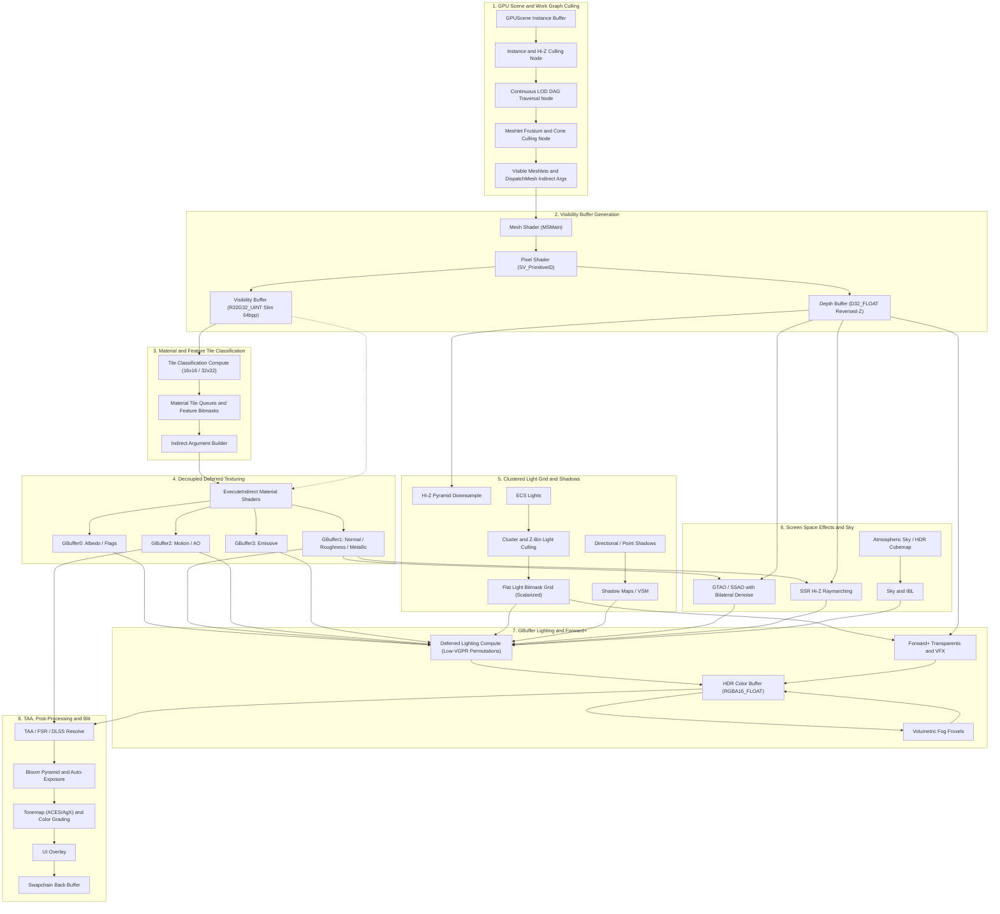
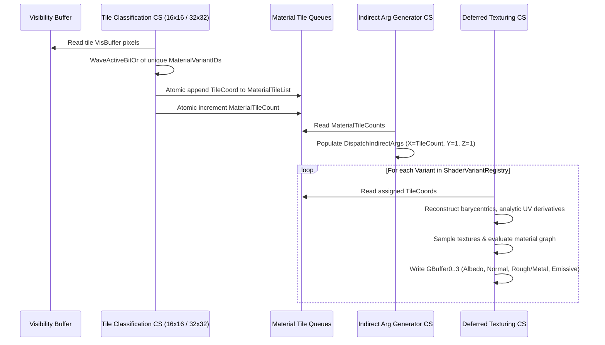

# GhostEngine — Modern GPU-Driven Rendering Pipeline Architecture & Master Plan

## 1. Executive Summary & Architectural Vision

GhostEngine is transitioning to an industry-leading, **GPU-driven, Visibility Buffer (V-Buffer) and Decoupled Shading (Deferred Texturing)** rendering pipeline. 

This architecture combines the extreme geometry throughput and sub-pixel triangle efficiency of **Visibility Buffers** (as seen in Unreal Engine 5 Nanite, Frostbite, and idTech 8) with the flexibility of **GBuffer-based deferred shading**, enabling rich screen-space effects (GTAO, SSR, SSGI), clustered lighting, and decoupled material evaluation without the severe raster quad-overshading / helper-lane penalties inherent to traditional deferred rendering.



---

## 2. Deep Dive: Comparative Analysis & Insights from Industry Literature

We have analyzed three milestone presentations representing the current state-of-the-art in production rendering:
1. **SIGGRAPH 2021 Advances — Epic Games Nanite: A Deep Dive** (*Brian Karis*)
2. **idTech 8 / DOOM: The Dark Ages 2024 — Visibility Buffer and Deferred Rendering** (*Dominik Lazarek & Philip Hammer*)
3. **SIGGRAPH 2017 — Improved Culling for Tiled and Clustered Rendering** (*Michal Drobot & Ivan Nevraev, Infinity Ward / Activision*)

### 1. Culling Architecture: Nanite's Persistent Threads vs. GhostEngine Work Graphs

```mermaid
flowchart TD
    subgraph Nanite2021 ["Nanite (SIGGRAPH 2021)"]
        N1["Single Dispatch Fixed Workgroups"] --> N2["Software MPMC Ring Queue in LDS/VRAM"]
        N2 --> N3["Persistent Threads Loop: Pop, Test LOD, Push Children"]
        N3 --> N4["Cluster Queue Batching"]
        N4 --> N5["Hardware and Software Rasterizer"]
    end

    subgraph GhostEngine2026 ["GhostEngine Work Graphs (DirectX 12 SM 6.8)"]
        W1["InstanceCullNode (Entry)"] -->|"Frustum & Coarse Hi-Z"| W2["MeshletHierarchyNode"]
        W2 -->|"LOD Error > Thresh: Hardware-Managed Recursion"| W2
        W2 -->|"Leaf Cluster Group Reached"| W3["MeshletCullNode"]
        W3 -->|"Frustum, Fine Hi-Z, Backface Cone"| W4["WriteVisibleMeshletNode"]
        W4 --> W5["DispatchMesh Indirect Args Buffer"]
    end
```



- **Why Nanite Used Persistent Threads (2021)**:
  Brian Karis explicitly noted on Slide 72:
  > *"Ideally, we would be able to just spawn new threads for the children directly from compute. But we don’t currently have any way to do that... Hopefully, PC programming models will catch up, so we can use optimizations like this with confidence on PC in the future."*
* **GhostEngine Decision (2026)**:
  **DirectX 12 Work Graphs is the exact programming model Karis envisioned.** By adopting D3D12 Work Graphs directly:
  - The driver and hardware work distributor handle the queue allocation, memory backing (`BackingMemory`), and scheduling automatically.
  - Zero software MPMC locks, zero atomic queue contention, zero risk of Windows TDR / watchdog timeout hangs.
  - Work Graphs is our primary, clean, first-class geometry pipeline.

#### Two-Pass Occlusion Culling (Adopted from Nanite)
Rather than a naive single-pass occlusion test, GhostEngine adopts Nanite's **Two-Pass HZB Occlusion flow**:
1. **Pass 1 (Main Pass)**: Test instances and meshlet DAG nodes against the **previous frame's HZB** using previous frame transforms. Emit visible meshlets and rasterize the primary Visibility Buffer.
2. **Rebuild Current HZB**: Downsample the current frame's depth buffer to create the initial HZB.
3. **Pass 2 (Post / Disocclusion Pass)**: Retest only the nodes/clusters that were marked occluded in Pass 1 against the **current frame's HZB**. Rasterize only the disoccluded geometry into the Visibility Buffer.
4. **Final HZB Build**: Complete HZB is generated for next frame's Pass 1.

---

### 2. Visibility Buffer Format: Lessons from DOOM: The Dark Ages (idTech 8)

In DOOM: The Dark Ages, id Software analyzed **Slim (64 bpp)** vs **Fat (128 bpp)** Visibility Buffers:
- **Fat Visibility Buffer (128 bpp)**: Stored triangle ID, instance ID, plus hardware UV-derivatives and tangent frames directly from pixel shader export. Result: hit severe pixel-export memory bandwidth bottlenecks.
- **Slim Visibility Buffer (64 bpp)**: Stored only triangle ID and surface/instance index. Result: **virtually zero bandwidth cost** because the pass was vertex-bound, not pixel-bound. Reconstructing barycentrics and UV derivatives analytically in compute was far faster than exporting them from raster!

#### GhostEngine Visibility Buffer Layout (Slim 64 bpp)
```hlsl
// VisBuffer RenderTarget Format: DXGI_FORMAT_R32G32_UINT
// Depth: DXGI_FORMAT_D32_FLOAT (Reversed-Z: 1.0 = near, 0.0 = far)

struct VisBufferPixel
{
    uint instanceID;          // 24 bits -> up to 16,777,216 instances
    uint localMaterialIndex;  // 8 bits  -> up to 256 sub-materials per mesh
    uint meshletIndex;        // 24 bits -> up to 16,777,216 meshlets per mesh
    uint primitiveID;         // 8 bits  -> triangle index within meshlet (0..123)
};

VisBufferPixel UnpackVisBuffer(uint2 raw)
{
    VisBufferPixel p;
    p.instanceID         = raw.x & 0x00FFFFFF;
    p.localMaterialIndex = (raw.x >> 24) & 0xFF;
    p.meshletIndex       = raw.y & 0x00FFFFFF;
    p.primitiveID        = (raw.y >> 24) & 0xFF;
    return p;
}
```

---

### 3. Material Classification: Quad Dispatch vs. Compute Dispatch

Both Epic Games (Nanite) and id Software (idTech 8) initially experimented with **Quad Dispatch with "Fake Material Depth"** (from Eidos Dawn Engine):
- **id Software's Profiling Results in DOOM**:
  - Forward+ baseline: **14.3 ms**
  - Quad Dispatch (Material Depth Equals test): **14.26 ms** — **NO improvement!**
  - Reason: Material IDs are non-hierarchical; Hi-Z cannot cull random screen-space material patterns. The GPU rasterizer front-end was flooded with millions of rejected fragments, stalling early-Z.
  - Compute Dispatch with Tile Classification: **10.4 ms (over 27% faster!)**.



#### Low-VGPR Shading Permutations (idTech 8 Technique)
In DOOM: The Dark Ages, they observed that monolithic "uber-shaders" inflate VGPR (Vector General Purpose Register) counts to 122+ VGPRs, dropping wave occupancy.
By recording a **32-bit Feature Bitmask** during tile classification:
- Base PBR tile: 78–88 VGPRs (high occupancy).
- Complex feature tile (decals, triplanar blood, wetness): 96–122 VGPRs.
- Compute dispatches execute specialized, lean kernels only on tiles that actually require those features!

---

### 4. Clustered Light Grid: Infinity Ward's Lessons (CoD: Infinite Warfare)

Infinity Ward proved that in dense or open-world scenes, standard 3D cluster grids ($X \times Y \times Z$ AABBs) suffer from:
1. **High Memory Overhead**: A fine 3D grid with pointer-based light lists explodes cache footprints.
2. **Wavefront Divergence**: When threads in a wave iterate over different light lists, vector ALU and memory units serialize.

#### Infinity Ward Innovations Adopted in GhostEngine:
1. **Flat Bit Array**: Represent light visibility using a bitmask (e.g. 256 bits = 8 `uint32` words). An entity's index corresponds to its bit index in the per-frame visible light list.
2. **Z-Binning**: Depth range is subdivided into uniform Z-Bins. A lightweight 1D table stores the `[minLightIndex, maxLightIndex]` active at that depth. In the shader, the 2D tile bitmask is masked by the 1D Z-Bin word range:
   $$\text{activeMask} = \text{tileMask}[\text{word}] \ \& \ \text{zBinMask}[\text{word}]$$
3. **Wave Scalarization Loop**: Instead of evaluating lights per-lane (vectorized divergence), loop over the active lights scalarized across the wave using `WaveActiveBitOr`, broadcasting light constants via scalar registers (SGPR/SMEM).

---

## 3. The 10-Phase Implementation Roadmap

```mermaid
flowchart LR
    P1["Phase 1: Work Graph Engine Plumbing & Resources"] --> P2["Phase 2: Work Graph Hierarchical Meshlet Culling"]
    P2 --> P3["Phase 3: Visibility Buffer Generation (MS+PS)"]
    P3 --> P4["Phase 4: Tile Material & Feature Classification"]
    P4 --> P5["Phase 5: Decoupled Deferred Texturing"]
    P5 --> P6["Phase 6: Clustered Z-Bin Lights & Shadows"]
    P6 --> P7["Phase 7: Sky, IBL & Deferred Lighting"]
    P7 --> P8["Phase 8: Screen-Space Effects (GTAO, SSR)"]
    P8 --> P9["Phase 9: Forward+ Transparents & Volumetric Fog"]
    P9 --> P10["Phase 10: TAA, Post-Processing & UI Blit"]
```



| Phase | Module | Key Architecture & Deliverables | Verification Strategy | Status |
| :--- | :--- | :--- | :--- | :--- |
| **Phase 1** | **Work Graph Engine Plumbing & Frame Resources** | Implement `SetProgram` & `DispatchGraph` in `D3D12CommandBuffer` (`ID3D12GraphicsCommandList10`), Work Graph RHI abstraction, `.ggraph` compiler/asset pipeline, `RenderFrameResources.cs`, Reversed-Z matrices. | Unit tests in `WorkGraphCompilerTests.cs` (DXIL bytecode generation, SM 6.8 nodes); clean build. | **Completed & Verified** |
| **Phase 2** | **Work Graph Meshlet Culler & Two-Pass HZB** | `MeshletCullGraph.ggraph` (SM 6.8 Work Graph with multi-entry points: `InstanceCullNode`, `HierarchyTraverseNode`, `MeshletCullNode`, `OccludedMeshletCullNode`), `CullCommon.hlsl` (reversed-Z HZB & LOD metric), `BuildHZB.gcomp`, `PrepareMeshletIndirectArgs.gcomp`, `HZBMipPyramid.cs`, `MeshletCullResources.cs`, `GhostRenderPipeline.Culling.cs`. | Full solution build clean (0 errors); all 153 `Ghost.UnitTest` and 28 `Ghost.AssetForge.Test` passing; assets baked & packed into pack files. | **Completed & Verified** |
| **Phase 3** | **Visibility Buffer Generation** | `VisibilityPass.hlsl` (Mesh Shader + Pixel Shader), `VisibilityBufferPass.cs`, slim 64 bpp format (`R32G32_UINT`), indirect dispatch mesh. | Inspected in PIX: distinct instances, meshlets, and triangle IDs visualized cleanly. | Pending Approval |
| **Phase 4** | **Tile Material & Feature Classification** | `TileMaterialClassification.hlsl`, `BuildIndirectArgs.hlsl`, `MaterialClassificationPass.cs` (16x16 tiles, feature bitmasks). | Material tile queues contain non-zero counts only for visible materials on screen. | Pending |
| **Phase 5** | **Deferred Texturing (Software GBuffer)** | `Lit_DeferredTexturing.template.hlsl`, barycentric attribute interpolation, analytic $ddx, ddy$ screen derivatives, GBuffer0..3 writeout. | Visual parity with forward pass, but with 0 quad overshading on high-density meshes. | Pending |
| **Phase 6** | **Clustered Z-Bin Lights & Shadows** | `ClusterLightCulling.hlsl` (Flat 256-bit mask + Z-Binning), `ContactShadows.hlsl`, Cascaded Shadow Maps (CSM). | Scalarized lighting loops verified in Nsight/PIX; smooth shadow projections. | Pending |
| **Phase 7** | **Sky, IBL & Deferred Lighting** | `DeferredLighting.hlsl` (Cook-Torrance BRDF, low-VGPR permutations), `BRDF.hlsl`, `AtmosphericSky.hlsl`. | Physically plausible PBR illumination written into `HDRColorBuffer` (RGBA16_FLOAT). | Pending |
| **Phase 8** | **Screen-Space Effects (GTAO, SSR)** | `GTAO.hlsl` (horizon search + bilateral denoise), `SSR.hlsl` (Hi-Z raymarching + IBL fallback). | Soft contact ambient occlusion in crevices and realistic reflections on glossy floors. | Pending |
| **Phase 9** | **Forward+ Transparents & Volumetric Fog** | `ForwardTransparentPass.cs` (accessing flat light bitmask), `VolumetricFog.hlsl` (3D Froxels 160x90x64). | Translucent particles lit by clustered lights; volumetric light shafts in shadowed areas. | Pending |
| **Phase 10** | **TAA, Post-Processing & UI Blit** | `TAA.hlsl` (YCoCg variance clipping + CAS sharpening), `Bloom.hlsl` (dual-filtering pyramid), `Tonemapping.hlsl` (ACES/AgX), `FinalBlitPass.cs`. | Stable, anti-aliased image with cinematic tonemapping and UI overlay presented to swapchain. | Pending |

---

## 4. Phase 1 Detailed Plan: Work Graph Engine Plumbing & Frame Resources

Phase 1 establishes the bedrock of the pipeline: implementing Work Graph execution in the RHI and RenderGraph, and setting up the frame resource scaffolding.

### Step 1.1: Complete D3D12 Work Graph Command List Support
In [`src/Runtime/Ghost.Graphics.D3D12/D3D12CommandBuffer.cs`](file:///F:/csharp/GhostEngine/src/Runtime/Ghost.Graphics.D3D12/D3D12CommandBuffer.cs):
- Maintain an `ID3D12GraphicsCommandList10*` pointer (queried from `pNativeObject` during command list creation/reset).
- Implement `SetProgram(scoped in SetProgramDesc desc)`:
  - Populate `D3D12_SET_PROGRAM_DESC` with `D3D12_PROGRAM_TYPE_WORK_GRAPH`.
  - Set `ProgramIdentifier`, `Flags`, `BackingMemory` address range, and `NodeLocalRootArgumentsTable`.
  - Call `pCmdList10->SetProgram(&setProgramDesc)`.
- Implement `DispatchGraph(scoped in DispatchGraphDesc desc)`:
  - Translate `GraphDispatchMode` (CPU input, GPU input, Multi-node).
  - Call `pCmdList10->DispatchGraph(&dispatchDesc)`.

### Step 1.2: RHI Work Graph Program Abstraction
Promote the prototype logic from `D3D12SimpleWorkGraph.cs` into first-class engine types:
- `D3D12WorkGraphProgram`: Owns the `ID3D12StateObject*`, program identifier, memory requirements calculation, and backing memory buffer (`_backingMemory`).
- Add `IWorkGraph` / `Handle<WorkGraph>` to `Ghost.Graphics.RHI` and `IResourceAllocator`.

### Step 1.3: RenderGraph Work Graph Pass Integration
In [`src/Runtime/Ghost.Graphics/RenderGraphModule/RenderGraph.cs`](file:///F:/csharp/GhostEngine/src/Runtime/Ghost.Graphics/RenderGraphModule/RenderGraph.cs) and [`RenderGraphContext.cs`](file:///F:/csharp/GhostEngine/src/Runtime/Ghost.Graphics/RenderGraphModule/RenderGraphContext.cs):
- Add `SetProgram(Handle<WorkGraph> workGraph)` and `DispatchGraph(scoped in DispatchGraphDesc desc)` to `IComputeRenderContext` (or dedicated `IWorkGraphRenderContext`).
- Allow `AddComputeRenderPass` to record and execute Work Graph dispatches seamlessly.
- Ensure the RenderGraph barrier compiler properly transitions UAV/SRV resources accessed by the Work Graph.

### Step 1.4: Render Frame Resources & Reversed-Z Scaffolding
- Create `RenderFrameResources.cs` in `Ghost.Engine.RenderPipeline`:
  - `VisibilityBuffer`: `RGTextureDesc.Relative(1.0f, 1.0f, ResourceFormat.R32G32_UInt)`
  - `DepthBuffer`: `RGTextureDesc.RelativeDepth(1.0f, ResourceFormat.D32_Float)`
  - `GBuffer0`: `RGTextureDesc.Relative(1.0f, 1.0f, ResourceFormat.R8G8B8A8_UNorm)`
  - `GBuffer1`: `RGTextureDesc.Relative(1.0f, 1.0f, ResourceFormat.R8G8B8A8_UNorm)`
  - `GBuffer2`: `RGTextureDesc.Relative(1.0f, 1.0f, ResourceFormat.R16G16B16A16_Float)`
  - `GBuffer3`: `RGTextureDesc.Relative(1.0f, 1.0f, ResourceFormat.R16G16B16A16_Float)`
  - `HDRColorBuffer`: `RGTextureDesc.Relative(1.0f, 1.0f, ResourceFormat.R16G16B16A16_Float)`
- Update `RenderPipelineUtility.GetVPMatrices` to produce Reversed-Z projection matrices ($[1.0 \rightarrow 0.0]$).
- Refactor [`GhostRenderPipeline.cs`](file:///F:/csharp/GhostEngine/src/Runtime/Ghost.Engine/RenderPipeline/GhostRenderPipeline.cs) to remove `MeshletTestPass` and structure passes modularly.

### Step 1.5: Verification
1. **Automated Smoke Test**: Create a unit/micro test running a compute Work Graph via `ICommandBuffer` and `RenderGraph` on the physical D3D12 device, validating that memory backing, program setting, and graph dispatch execute cleanly.
2. **Runtime Verification**: Run `TestGame` to ensure frame execution, resource transitions, and reversed-Z depth clearing operate without D3D12 validation layer warnings.
